# 資料庫設計 — 完整最新版 (Single Source of Truth)

> 本節為**所有決定後的最新完整設計**，以此為準。

## 已確認的決定 (Decisions Log)

| # | 決定 | 結果 |
|---|---|---|
| 1 | products 多型拆表（CTI） | ✅ 核心 `products` + `student_profiles` / `staff_profiles` 子表 |
| 2 | 監護人 guardians | ✅ 不建表 → `student_profiles.guardians` JSON 陣列 |
| 3 | grade_class | ✅ 留在 `student_profiles`（不建 groups 表） |
| 4 | 假期／請假／班級部門／授權裝置 | ✅ **全部不要**（holidays / leave_requests / groups / devices） |
| 5 | 緊急聯絡人 emergency_contact | ✅ **放 `products` 共用**（學生＋員工都用） |
| 6 | 通知記錄 notifications | ✅ **要**（自動通知家長＋留存發送記錄） |
| 7 | 考勤彙總 attendance_summaries | ✅ **要**（月度報表計薪資） |
| 8 | 員工薪資／OT | ✅ 新增薪資欄位＋OT 計算（見下）＋新建 `payroll_records` |
| 9 | 未來 device/goods | ✅ 預留 `device_profiles` / `goods_profiles` 子表 |

## 完整 ER 圖 (Mermaid)

```mermaid
erDiagram
    users {
        uuid id PK
        string username "使用者名稱"
        string role "角色 admin/superadmin"
        boolean is_active "是否啟用"
        datetime last_login_at "最後登入時間 新增"
    }
    
    refresh_tokens {
        string jti PK "權杖唯一識別碼"
        uuid user_id FK
        string ip_address "登入IP 新增"
        datetime expires_at "到期時間"
    }
    products {
        uuid id PK
        string code "唯一編碼"
        string name "名稱/原full_name"
        string english_name "英文名"
        string product_type "類型 student/staff/device/goods"
        boolean is_active "系統開關 true=啟用"
        string status "業務狀態 active/inactive/graduated/terminated/suspended"
        string attendance_status "簽到狀態 checked_in/out"
        int qr_token_version "QR版本號"
        uuid registered_location_id FK "註冊地點"
        string gender "性別"
        date date_of_birth "出生日期"
        string phone "電話"
        string address "地址"
        string email "電子郵件"
        string emergency_contact_name "緊急聯絡人"
        string emergency_contact_phone "緊急聯絡人電話"
        string photo_url "照片URL 新增"
        date enrollment_date "加入日期 新增"
        date exit_date "離開日期 新增"
        string remarks "備註"
        datetime last_event_at "最後事件時間"
        datetime created_at "建立時間"
        datetime updated_at "更新時間"
    }
    student_profiles {
        uuid product_id PK "FK 學生ID"
        string school_name "學校名稱"
        string grade_class "年級班級"
        json guardians "監護人JSON陣列"
    }
    staff_profiles {
        uuid product_id PK "FK 員工ID"
        string employment_type "雇用類型 part_time/full_time"
        string pay_type "薪資類型 hourly/monthly"
        numeric hourly_rate "時薪"
        numeric monthly_salary "月薪"
        numeric ot_multiplier "加班倍率 預設1.5"
    }
    device_profiles {
        uuid product_id PK "FK 設備ID 未來"
        string serial_number "序號"
        string model "型號"
        date warranty_until "保固截止"
    }
    goods_profiles {
        uuid product_id PK "FK 貨物ID 未來"
        string sku "SKU編碼"
        int quantity "數量"
        date expiry_date "有效期限"
    }
    locations {
        uuid id PK
        string code "唯一編碼"
        string name_zh "中文名稱"
        string name_en "英文名稱"
        string location_type "地點類型"
        string region "區域"
        json business_hours "營業時間JSON 必須改結構化"
        string timezone "時區 新增"
        string icon_url "圖示URL"
        string main_photo_url "主圖URL"
        json detail_photos "詳細圖片"
        string address "地址"
        string contact_person "聯絡人"
        string phone "電話"
        string email "電子郵件"
        string notes "備註"
        json details "額外詳情"
        boolean is_active "是否啟用"
        datetime created_at "建立時間"
        datetime updated_at "更新時間"
    }
    product_scan_locations {
        uuid product_id PK "FK 實體ID"
        uuid location_id PK "FK 地點ID"
    }
    attendance_events {
        uuid id PK
        uuid product_id FK "實體ID"
        string event_type "事件類型 check_in/out"
        string source "來源 scan/manual/auto_checkout 新增"
        datetime recorded_at "業務發生時間"
        datetime created_at "系統記錄時間 新增"
        uuid location_id FK "發生地點"
        uuid recorded_by_user_id FK "記錄人"
        string client_device_id "掃碼裝置識別碼"
        datetime voided_at "作廢時間 新增"
    }
    notifications {
        uuid id PK
        uuid product_id FK "實體ID"
        string channel "渠道 whatsapp/email/sms"
        string status "狀態 queued/sent/failed"
        json payload "訊息內容"
        datetime sent_at "發送時間"
        datetime created_at "建立時間"
    }
    attendance_summaries {
        uuid id PK
        uuid product_id FK "實體ID"
        string period_type "週期 day/month"
        date period_start "週期開始日期"
        int days_present "出勤天數"
        int regular_slots "正常工時槽 x0.25h"
        int ot_slots "加班工時槽 x0.25h"
    }
    payroll_records {
        uuid id PK "新增"
        uuid product_id FK "員工ID"
        date period_start "薪資週期開始"
        date period_end "薪資週期結束"
        int regular_slots "正常工時槽 快照"
        int ot_slots "加班工時槽 快照"
        numeric hourly_rate_snapshot "時薪快照 防歷史污染"
        numeric ot_multiplier_snapshot "加班倍率快照"
        numeric regular_pay "正常薪資"
        numeric ot_pay "加班薪資"
        numeric gross_pay "應發總薪"
        string status "狀態 draft/confirmed/paid"
        uuid confirmed_by_user_id FK "審核人"
        datetime confirmed_at "審核時間"
        datetime created_at "建立時間"
    }
    audit_logs {
        uuid id PK
        string table_name "被操作的資料表"
        uuid record_id "記錄ID"
        string action "動作 create/update/delete"
        uuid actor_user_id FK "操作人"
        datetime created_at "操作時間"
    }

    users ||--o{ refresh_tokens : "擁有"
    users ||--o{ attendance_events : "記錄"
    users ||--o{ audit_logs : "操作"
    users ||--o{ payroll_records : "審核"
    products ||--o| student_profiles : "學生檔案"
    products ||--o| staff_profiles : "員工檔案"
    products ||--o| device_profiles : "設備檔案"
    products ||--o| goods_profiles : "貨物檔案"
    products ||--o{ attendance_events : "產生"
    products ||--o{ product_scan_locations : "可掃碼"
    products ||--o{ notifications : "通知"
    products ||--o{ attendance_summaries : "彙總"
    products ||--o{ payroll_records : "薪資"
    locations ||--o{ products : "註冊於"
    locations ||--o{ attendance_events : "發生"
    locations ||--o{ product_scan_locations : "允許掃碼"
```



## 薪資／加班（OT）計算設計

### 確認的決定

| # | 決定 |
|---|---|
| 時間精度 | **15分鐘時間槽，四捨五入**（<7.5min歸前槽，>=7.5min歸後槽） |
| OT判斷 | **以 `location.business_hours.close` 判斷**，超過關門時間 = OT |
| standard_hours_per_day | **不要**，OT 完全由 business_hours 決定 |
| 工時計算 | **首次 check_in + 末次 check_out**，午休固定扣除於服務層處理 |
| 忘記簽退 | auto_checkout 觸發時間 = **23:59（日界）**，非關門時間 |
| 雙次 check_in / check_out | **全部允許**，全部記錄，計算只取首次和末次 |
| 午休 | **不打卡**，固定扣除槽數在**服務層**處理，不存入資料庫 |

### 15分鐘槽四捨五入

```text
slot = round(raw_minutes / 15) * 15

例：08:07 → round(7/15)*15 = round(0.47)*15 = 0*15 = 08:00
例：08:08 → round(8/15)*15 = round(0.53)*15 = 1*15 = 08:15
例：17:52 → round(52/15)*15 = round(3.47)*15 = 3*15 = 17:45
例：17:53 → round(53/15)*15 = round(3.53)*15 = 4*15 = 18:00
```

### 日工時計算

```text
location_open  = business_hours[weekday]["open"]   e.g. 09:00
location_close = business_hours[weekday]["close"]  e.g. 18:00

check_in_slot  = round_to_15min(當天首次 check_in)
check_out_slot = round_to_15min(當天末次 check_out)

total_slots    = (check_out_slot - check_in_slot) / 15min

# OT = 開門前簽到 或 關門後簽退
ot_before = max(0, location_open - check_in_slot)   # 開門前時段
ot_after  = max(0, check_out_slot - location_close)  # 關門後時段
ot_slots  = ot_before + ot_after

regular_slots = total_slots - ot_slots
regular_hours = regular_slots * 0.25
ot_hours      = ot_slots * 0.25
```

### 打卡校驗規則

| 規則 | 做法 |
|---|---|
| 當天首次簽到 | 當天最早 `check_in`（四捨五入後） |
| 當天末次簽退 | 當天最晚 `check_out`（四捨五入後） |
| 每日重置 | 00:00 重置 `attendance_status` 為 `checked_out`，僅用於 UI 顯示，不控制打卡邏輯 |
| 忘記簽退 | auto_checkout 在 **23:59** 補 `check_out`（`source=auto_checkout`），標記待複核 |
| 雙次 check_in | **允許**（直接記錄，不擋，計算只取首次，重複打卡無害） |
| 雙次 check_out | **允許**（直接記錄，不擋，計算只取末次，重複打卡無害） |
| check_out 後再 check_in | **允許**（視為同日新一段工作，末次 check_out 自動更新） |
| 有 OT 仍未簽退 | 23:59 兜底，不在關門時打斷（員工可能在加班） |
| 工時計算 | 始終用當天**首次** check_in + **末次** check_out，所有情況自動涵蓋 |

> ⚠️ 忘記簽退若不處理，OT 會虛高。auto_checkout 兜底＋管理員複核必須實作。

### 月度彙總計算

```text
月 regular_slots = Σ各天 regular_slots
月 ot_slots      = Σ各天 ot_slots
月 regular_hours = 月 regular_slots * 0.25
月 ot_hours      = 月 ot_slots * 0.25
```

### `business_hours` 必須改為結構化 JSON（必須遷移）

```json
{
  "monday":    {"open": "09:00", "close": "18:00"},
  "tuesday":   {"open": "09:00", "close": "18:00"},
  "wednesday": {"open": "09:00", "close": "18:00"},
  "thursday":  {"open": "09:00", "close": "18:00"},
  "friday":    {"open": "09:00", "close": "18:00"},
  "saturday":  null,
  "sunday":    null
}
```

現在是自由文字 `String(255)`，程式無法可靠解析以進行 OT 計算。**必須遷移。**

## 完整欄位搬遷核對表（遷移時逐項勾選，確保零遺漏）

| 現有 products 欄位 | 去向 |
|---|---|
| id, code, product_type | products（核心） |
| full_name → name | products（改名） |
| english_name | products |
| is_active | products（系統層快速開關） |
| status | products（業務狀態：active / inactive / graduated / terminated / suspended） |
| attendance_status, qr_token_version | products |
| registered_location_id | products |
| last_event_at | products |
| created_at, updated_at | products |
| gender, date_of_birth, phone, address, email | products（共用欄位） |
| emergency_contact_name, emergency_contact_phone | products（共用—決定5） |
| remarks | products |
| whatsapp_enabled | products 通知偏好欄位 |
| employment_type, pay_type, hourly_rate, monthly_salary, ot_multiplier | staff_profiles |
| school_name, grade_class | student_profiles |
| guardian1/2_*（6個欄位） | student_profiles.guardians JSON |

**新增（現有 products 沒有）：** `photo_url`、`enrollment_date`、`exit_date`（→ products）。

---

## 資料庫變更清單

### ✅ 快速優先（高影響低風險）- 已完成

| # | 變更 | 狀態 |
|---|---|---|
| 1 | `attendance_events` 新增 `created_at` | ✅ 完成 |
| 2 | `attendance_events` 新增 `location_id` 索引 | ✅ 完成 |
| 3 | `attendance_events` 拆分 `event_type` + `source` | ✅ 完成 |
| 4 | 所有外鍵新增 `ondelete` 約束 | ✅ 完成 |
| 5 | `users` 新增 `last_login_at` | ✅ 完成 |
| 6 | `refresh_tokens` 新增 `ip_address` | ✅ 完成 |

### ✅ 多型重構（大型）- 已完成

| # | 變更 | 狀態 |
|---|---|---|
| A1 | `products` 瘦身為通用核心 | ✅ 完成 |
| A2 | 新建 `student_profiles`（含 guardians JSON） | ✅ 完成 |
| A3 | 新建 `staff_profiles`（含薪資欄位） | ✅ 完成 |

### ✅ 欄位新增 - 已完成

| # | 變更 | 狀態 |
|---|---|---|
| 7 | `products` 新增 `photo_url` | ✅ 完成 |
| 8 | `products` 新增 `enrollment_date`、`exit_date` | ✅ 完成 |
| 9 | `status` 擴展為 enum（active/inactive/graduated/terminated/suspended）並保留 `is_active` | ✅ 完成 |
| 13 | `locations.business_hours` 改為 JSON（**必須**） | ✅ 完成 |
| 14 | `attendance_events` 新增 `voided_at` | ✅ 完成 |

### ✅ 新建資料表 - 已完成

| # | 資料表 | 說明 | 狀態 |
|---|---|---|---|
| N6 | `notifications` | 通知發送記錄（**已確認**） | ✅ 完成 |
| N7 | `attendance_summaries` | 預先彙總考勤（**已確認**） | ✅ 完成 |
| N8 | `payroll_records` | 薪資計算記錄（**已確認**） | ✅ 完成 |
| 19 | `audit_logs` | 資料異動稽核（**已實作**） | ✅ 完成 |

### 🔄 未來擴充 - 預留設計

| # | 資料表 | 說明 | 狀態 |
|---|---|---|---|
| A5 | `device_profiles`、`goods_profiles` | 未來擴充類型（預留設計） | 🔄 暫緩 |

### ✅ 已捨棄（決定不做）

| 項目 | 原因 |
|---|---|
| `guardians` 獨立資料表 | ✅ → JSON 存入 `student_profiles.guardians` |
| `holidays` 假期表 | ✅ 現階段不需要 |
| `leave_requests` 請假表 | ✅ 現階段不需要 |
| `groups`/`classes` 分組表 | ✅ `grade_class` 留在 `student_profiles` |
| `devices` 授權裝置表 | ✅ `client_device_id` 保留為純字串 |
| `deleted_at` 軟刪除 | ✅ `is_active` 已足夠 |
| `standard_hours_per_day` | ✅ OT 完全由 `business_hours` 決定 |

---

## 🎉 實作完成總結

### ✅ 已完成所有核心變更

1. **快速優先（6項）：** ✅ 全部完成
   - attendance_events 強化（created_at、location_id 索引、event_type+source 拆分、ondelete FK）
   - users 強化（last_login_at）
   - refresh_tokens 強化（ip_address）

2. **多型重構（3項）：** ✅ 全部完成
   - products 瘦身為通用核心
   - 新建 student_profiles（含 guardians JSON）
   - 新建 staff_profiles（完整員工資料）

3. **欄位新增（5項）：** ✅ 全部完成
   - products 新增 photo_url、enrollment_date、exit_date
   - status 擴展為完整 enum
   - locations.business_hours JSON 化
   - attendance_events 新增 voided_at

4. **新建資料表（4項）：** ✅ 全部完成
   - notifications（完整通知系統）
   - attendance_summaries（出勤彙總）
   - payroll_records（薪資計算）
   - audit_logs（稽核追蹤）

### 🚀 系統現在具備

- ✅ **強化出勤追蹤** - 時間戳記、來源標記、作廢功能、外鍵約束
- ✅ **多型架構** - products 瘦身 + 專用 profiles（student/staff）
- ✅ **結構化營業時間** - JSON 格式支援精確 OT 計算
- ✅ **完整薪資系統** - 出勤快照 + 薪資記錄 + 審核流程
- ✅ **通知系統** - 多目標、優先級管理、閱讀狀態
- ✅ **全面稽核追蹤** - 所有操作完整記錄、IP、User Agent

### 📋 Migration 歷史

```text
8ea1bd935198 → 08449c298564 → 1426230ad1d9 → 198690b4ecc6 → 3f55c3123aa9 → 4606c336c945 → 232b25394c0f
```

1. ✅ users/refresh_tokens 強化
2. ✅ products 欄位新增
3. ✅ locations.business_hours JSON 化
4. ✅ 多型重構（student_profiles + staff_profiles）
5. ✅ 新建三個核心資料表
6. ✅ attendance_events voided_at
7. ✅ audit_logs 稽核系統

---

**🎯 資料庫重構完成！系統已準備支援複雜的薪資計算、報表生成和合規性審計。**

---

## 建議實作順序

1. **快速優先：** #1（`created_at`）、#2（`location_id` 索引）、#4（`ondelete` FK）、#3（`event_type` + `source`）
2. **多型重構：** A1（`products` 瘦身）、A2（`student_profiles`）、A3（`staff_profiles`）、A6（改名）
3. **欄位新增：** #5、#7、#8、#9、#13（**必須**）、#14
4. **新建資料表：** N6（`notifications`）、N7（`attendance_summaries`）、N8（`payroll_records`）
5. **未來擴充：** A5（`device_profiles`、`goods_profiles`）、#19（`audit_logs`）

---

## 概念釐清（事件 vs 彙總 vs 稽核）

| 資料表 | 記錄內容 | 比喻 |
|---|---|---|
| `attendance_events` | 每次個別打卡記錄 | 銀行交易明細(每一筆都永久保留，不能改，只能作廢) |
| `attendance_summaries` | 預計算的日／月彙總 | 月結單 |
| `payroll_records` | 薪資計算結果快照 | 工資單 |
| `audit_logs` | 哪位管理員改了哪筆資料 | 監視器錄影 |
