# AQUA 專案手冊（統合版）

> 本文檔將 `docs/` 資料夾內所有文件統合為一本手冊，以繁體中文呈現。最後更新：2026-07-21。

---

## 目錄

1. [專案概述](#1-專案概述)
2. [本地開發與快速開始](#2-本地開發與快速開始)
3. [生產部署](#3-生產部署)
4. [CI/CD 說明](#4-cicd-說明)
5. [已知缺口與代碼審查](#5-已知缺口與代碼審查)
6. [運維手冊](#6-運維手冊)
7. [Mobile 開發與發布](#7-mobile-開發與發布)
8. [發布記錄](#8-發布記錄)
9. [附錄](#9-附錄)
10. [資料庫 ER 圖](#10-資料庫-er-圖)

---

## 1. 專案概述

### 1.1 系統架構

AQUA 是一款為補習班（juku）設計的時間與出勤系統。教職員與學生以 **Unit** 身份存在，透過 QR 碼簽到/簽退；**管理員**（`admin` / `superadmin`）透過 Web 與 Mobile App 登入管理資料並掃描 QR。

```
┌─────────────────────────────────────────────────────────────┐
│  Units（教職員 / 學生）                                          │
│  每人有一個簽名 QR（JWT）— 同一個 QR 反覆簽到/簽退                │
└───────────────────────────────┬─────────────────────────────┘
                                │ scan
                                ▼
┌─────────────┐     ┌──────────────┐     ┌─────────────────────────┐
│  Mobile App │────▶│   FastAPI    │◀────│   Vue 3 Web App         │
│  (Expo/RN)  │     │  apps/api    │     │  apps/web/attendance/   │
│  QR scanner │     │              │     │  admin console          │
└─────────────┘     └──────┬───────┘     └─────────────────────────┘
                           │
                    ┌──────┴───────┐
                    │  PostgreSQL  │
                    └──────────────┘
```

| 概念 | 說明 |
|------|------|
| **User** (`users`) | 登入帳號：`admin` 或 `superadmin` |
| **Unit** (`units`) | 可簽到的實體：`unit_type` = `staff`、`student`、`device`、`goods` |
| **Profile** (`student_profiles` / `staff_profiles`) | 類型專屬資料：學生（學校、監護人）/ 員工（雇用類型、薪資） |
| **Attendance event** | `check_in`、`check_out`、`manual_correction` 或 `auto_checkout` |
| **Attendance summary** | 預計算的日／月彙總（`attendance_summaries`）；瀏覽讀 DB，重算用 Generate — 見 [attendance-summaries.md](attendance-summaries.md) |
| **Payroll record** | 薪資計算結果快照（`payroll_records`） |
| **Audit log** | 資料異動稽核記錄（`audit_logs`） |

### 1.2 倉庫結構

| 路徑 | 說明 |
|------|------|
| `apps/api/` | FastAPI — 認證、Unit、Profile、QR 簽名、Attendance、薪資、稽核 |
| `apps/web/` | Vue 3 管理後台 (`src/pages/attendance/`)，基於 AQUA 模板 |
| `apps/mobile/` | Expo App — QR 掃描器 + 歷史紀錄 |
| `docker-compose.yml` | 開發：PostgreSQL + API |
| `deploy/` | 生產：Caddy + web + api + db |
| `docs/` | 本手冊、後端審查、資料庫設計、運維指南 |

### 1.3 QR Token 流程

1. 管理員呼叫 `GET /api/qr/token/{unit_id}` → 取得簽名 JWT
2. Payload：`{ sub: unit_id, ver: qr_token_version, jti, iat, type: "qr" }`
3. 以 `QR_SECRET` 簽名（與 `SECRET_KEY` 分離）
4. **無到期日** — 同一個 QR 印在識別證/鎖定畫面；每次掃描切換簽到/簽退
5. 掃描器將 token POST 到 `/api/attendance/scan`
6. 伺服器驗證簽名與 `ver` 是否匹配；版本過期 → "rotated"

**輪替**：`POST /api/qr/token/{unit_id}/refresh` 會增加 `qr_token_version`，使舊 QR 失效。

### 1.4 簽到/簽退切換邏輯

- `attendance_status`：`checked_out` → 掃描 → `check_in`；`checked_in` → 掃描 → `check_out`
- 若最後一次 event 在**前一日（Asia/Hong_Kong）**，下一次掃描一律從 `check_in` 開始（處理跨夜）
- 管理員可透過 `POST /api/attendance/manual` 手動校正

### 1.5 防重複掃描（Debounce）

同一個 Unit 在 `SCAN_DEBOUNCE_SECONDS`（預設 3 秒）內被重複掃描，會回傳**同一筆**既有 event（適用於櫃檯雙擊），不會產生重複 row。

### 1.6 API 授權

| Endpoint | 所需權限 |
|----------|----------|
| `POST /api/auth/register` | 無（一律 **403** — 使用 User Management） |
| `POST /api/auth/login`, `/refresh` | 無 |
| `GET /api/auth/me` | Bearer |
| `GET/PATCH /api/users` | Admin |
| `POST /api/users` | Admin |
| `DELETE /api/users/:id` | **Superadmin** |
| `GET/POST/PATCH/DELETE /api/units` | Admin |
| `GET/POST /api/qr/token/...` | Admin |
| `POST /api/attendance/scan` | Admin |
| `GET /api/attendance` | Admin |
| `POST /api/attendance/manual` | Admin |
| `GET /api/attendance/export/csv` | Admin |
| `GET /api/attendance/stats` | Admin |
| `GET /api/attendance-summaries` | Admin |
| `GET /api/attendance-summaries/overview` | Admin |
| `POST /api/attendance-summaries/generate` | Admin |
| `GET/POST/PATCH /api/payroll-records` | Admin |
| `POST /api/payroll-records/generate` | Admin |
| `GET/PATCH /api/notifications` | Admin |
| `GET /api/audit-logs` | Superadmin |
| `POST /api/auto-checkout/run` | Admin（**手動** Day-end；尚無 23:59 cron） |
| `GET /api/auto-checkout/status` | Admin |
| `GET/POST/PATCH /api/staff-profiles` | Admin |
| `GET/POST/PATCH /api/student-profiles` | Admin |
| `GET /api/health` | 無 |

### 1.7 環境變數

**API** (`apps/api/.env`)

| 變數 | 預設 | 說明 |
|------|------|------|
| `DATABASE_URL` | `postgresql+asyncpg://...` | Async 連線 |
| `DATABASE_URL_SYNC` | `postgresql+psycopg://...` | Alembic 同步連線 |
| `SECRET_KEY` | （生產必填） | JWT 簽名 |
| `QR_SECRET` | （生產必填） | QR token 簽名 |
| `SCAN_DEBOUNCE_SECONDS` | `3` | 防重複掃描秒數 |
| `ACCESS_TOKEN_EXPIRE_MINUTES` | `30` | Access token TTL |
| `REFRESH_TOKEN_EXPIRE_DAYS` | `7` | Refresh token TTL |
| `CORS_ORIGINS` | localhost | 逗號分隔的允許來源 |
| `ENV` | `development` | `production` 會啟用密鑰驗證 |
| `LOGIN_RATE_LIMIT` | `5/minute` | 登入限流 |
| `SCAN_RATE_LIMIT` | `30/minute` | 掃描限流 |
| `REDIS_URL` | `redis://redis:6379/0` | Rate limit 共用儲存（多副本） |

**Web** (`apps/web/.env`)：`VITE_ATTENDANCE_API_URL` = `http://localhost:8000/api`（生產 image 在 build 時烘焙）

**Mobile** (`apps/mobile/.env`)：`EXPO_PUBLIC_API_URL` = `http://localhost:8000/api`（實體裝置請改用 LAN IP）

**生產伺服器** (`deploy/.env`)：詳見 §3 部署指南。

### 1.8 種子資料

執行 `python seed.py` 後會建立預設帳號與示範人員。

| 欄位 | 說明 |
|------|------|
| 預設帳號 | 使用者名稱與密碼見 `apps/api/seed.py`（**勿寫入公開文件**） |
| 角色 | `admin`、`superadmin` |
| 示範人員 | 例如 `STAFF-001`（staff）、`STU-001`（student） |

**生產環境務必在 seed 後立即修改所有預設密碼；公開文件請勿列出實際密碼。**

---

## 2. 本地開發與快速開始

### 2.1 推薦開發模式（Hybrid）

PostgreSQL 跑在 Docker；API 與 Web 在本地機器（hot reload）。

| Terminal | 目錄 | 指令 | 時機 |
|----------|------|------|------|
| 1 | repo root | `docker compose up -d db` | 重開機後或 DB 未執行時 |
| 2 | `apps/api` | `python -m uvicorn app.main:app --reload` | 每次開發 |
| 3 | `apps/web` | `npm run dev` | 每次開發 |

關閉 Terminal 2–3 只會停止 API/Web。DB container 持續運行直到 `docker compose down`。資料透過 Docker volume 持久化。

**網址**：API http://localhost:8000/docs · Web http://localhost:5173/attendance/login

### 2.2 首次設定 — 完整堆疊

```bash
# 1. DB + API
docker compose up -d db
cd apps/api
cp .env.example .env
pip install -r requirements.txt
alembic upgrade head
python seed.py
python -m uvicorn app.main:app --reload

# 2. Web
cd apps/web
cp .env.example .env
npm install
npm run dev
# Open: http://localhost:5173/attendance/login

# 3. Mobile
cd apps/mobile
cp .env.example .env
# 編輯 EXPO_PUBLIC_API_URL 為 LAN IP（實體裝置）
npm install
npx expo start
```

### 2.3 常用指令

| 任務 | 指令 |
|------|------|
| 跑 migration | `alembic upgrade head` |
| 重載種子資料 | `python seed.py` |
| 安裝新依賴 | `npm install` / `pip install -r requirements.txt` |
| 檢視 DB | DBeaver 連線 `127.0.0.1:5432`；帳密見 `apps/api/.env.example`（本地開發預設） |

### 2.4 測試

```bash
cd apps/api
pip install -r requirements.txt   # 含 aiosqlite
pytest -v
pytest tests/test_auth.py -v
pytest tests/test_scan.py -v
```

---

## 3. 生產部署

### 3.1 架構

單一伺服器運行四個服務：

- **web** — Vue admin（nginx）from GHCR
- **api** — FastAPI from GHCR
- **db** — PostgreSQL 16
- **caddy** — HTTPS reverse proxy

Mobile App 獨立編譯；指向 `https://<API_DOMAIN>/api`。

### 3.2 前置需求

- Ubuntu 伺服器 + 公開 IP
- DNS A 記錄：`app.yourdomain.com` 與 `api.yourdomain.com` 指向伺服器 IP
- GitHub Actions 已發布 image 到 GHCR（`docker-publish` workflow on `main`）

### 3.3 安裝 Docker

```bash
sudo apt update && sudo apt upgrade -y
sudo apt install -y ca-certificates curl gnupg lsb-release
sudo install -m 0755 -d /etc/apt/keyrings
curl -fsSL https://download.docker.com/linux/ubuntu/gpg | sudo gpg --dearmor -o /etc/apt/keyrings/docker.gpg
echo "deb [arch=$(dpkg --print-architecture) signed-by=/etc/apt/keyrings/docker.gpg] https://download.docker.com/linux/ubuntu $(. /etc/os-release && echo "$VERSION_CODENAME") stable" | sudo tee /etc/apt/sources.list.d/docker.list > /dev/null
sudo apt update
sudo apt install -y docker-ce docker-ce-cli containerd.io docker-buildx-plugin docker-compose-plugin
sudo systemctl enable docker
sudo systemctl start docker
```

免 sudo 執行 Docker（選用）：
```bash
sudo usermod -aG docker $USER
newgrp docker
```

### 3.4 登入 GHCR

建立 GitHub Personal Access Token（`read:packages` 權限）：

```bash
echo "YOUR_GITHUB_PAT" | docker login ghcr.io -u YOUR_GITHUB_USERNAME --password-stdin
```

### 3.5 準備 deploy 目錄

```bash
mkdir -p ~/aqua-attendance/deploy
cd ~/aqua-attendance/deploy
```

從 repo 複製以下檔案到伺服器：
- `docker-compose.prod.yml`
- `Caddyfile`
- `.env.example` → `.env`
- `first-boot.sh`, `update.sh`, `reset-db.sh`

```bash
cp .env.example .env
chmod +x first-boot.sh update.sh reset-db.sh
```

### 3.6 生成 API 密鑰

API container 以 `ENV=production` 運行。啟動時**若密鑰仍是佔位符或短於 32 字元會直接拒絕啟動**。

```bash
openssl rand -hex 32   # 執行兩次，分別用於 SECRET_KEY 與 QR_SECRET
```

填入 `deploy/.env`：
```env
SECRET_KEY=<第一次的 64 字元 hex>
QR_SECRET=<第二次的 64 字元 hex>
```

規則：
- 兩個值**必須不同**（用途不同）
- **不要** commit 真實密鑰到 Git
- 上線後輪替密鑰會使既有登入與 QR 失效；規劃維護時段

Windows 無 OpenSSL：使用 WSL/Git Bash，或 PowerShell：
```powershell
[Convert]::ToHexString((1..32 | ForEach-Object { Get-Random -Maximum 256 })).ToLower()
```

### 3.7 編輯 deploy/.env

| 變數 | 設定值 |
|------|--------|
| `APP_DOMAIN` | App 主機名 |
| `API_DOMAIN` | API 主機名 |
| `WEB_IMAGE` / `API_IMAGE` | `ghcr.io/<user>/aqua-attendance/web:main` 等 |
| `POSTGRES_PASSWORD` | 強密碼 |
| `SECRET_KEY` / `QR_SECRET` | 兩組 `openssl rand -hex 32` |
| `CORS_ORIGINS` | `https://app.yourdomain.com` |

**僅用 IP（無域名）**：`APP_DOMAIN` 與 `API_DOMAIN` 都設為公開 IP。Caddy 會將 `/api/*` 導到 API，其餘導到 Web。

若 API container 啟動後立即退出，檢查 log（通常是佔位符密鑰）：
```bash
docker compose -f docker-compose.prod.yml --env-file .env logs api --tail=30
```

### 3.8 Web Image 必須包含 API URL

GitHub → **Settings → Secrets and variables → Actions → Variables**：
- `VITE_ATTENDANCE_API_URL` = `https://api.yourdomain.com/api`

修改後需重新執行 **Publish container images** workflow，web bundle 才會使用正確的 API URL。

### 3.9 啟動服務

使用腳本：
```bash
./first-boot.sh    # 首次：檢查 Docker、pull image、up -d
```

或手動：
```bash
docker compose -f docker-compose.prod.yml --env-file .env pull
docker compose -f docker-compose.prod.yml --env-file .env up -d
docker compose -f docker-compose.prod.yml --env-file .env ps
```

#### 種子資料庫（首次安裝）

`first-boot.sh` **不會** 執行 `seed.py`。container 健康後：
```bash
docker compose -f docker-compose.prod.yml --env-file .env exec api python seed.py
```

產生 `admin` / `superadmin` 與範例 units。**立即修改密碼**。

若要全新開始（migration + seed），使用 `reset-db.sh`（破壞性）。

### 3.10 驗證

- App: `https://app.yourdomain.com/attendance/login`
- API health: `https://api.yourdomain.com/api/health`
- Swagger: `https://api.yourdomain.com/docs`

### 3.11 更新到新版本

CI 推送新 image 後：
```bash
cd ~/aqua-attendance/deploy
./update.sh
```

或：
```bash
docker compose -f docker-compose.prod.yml --env-file .env pull
docker compose -f docker-compose.prod.yml --env-file .env up -d
```

### 3.12 重置資料庫（breaking schema change）

```bash
cd deploy
./reset-db.sh
```

流程：停 API → DROP + recreate schema → pull latest image → 啟動 API（自動跑 migration）→ 執行 `seed.py` → 重啟所有服務。

> ⚠️ **警告**：刪除**所有**資料。僅用於 breaking upgrade 或全新安裝。

### 3.13 輔助腳本

| 腳本 | 用途 |
|------|------|
| `first-boot.sh` | 檢查 Docker、pull image、up -d |
| `update.sh` | Pull 最新 image 並重啟 |
| `reset-db.sh` | 清空 DB、migration、seed |

### 3.14 上線前安全檢查清單

- [ ] `SECRET_KEY` 與 `QR_SECRET` 已透過 `openssl rand -hex 32` 設定（API 會在 `ENV=production` 時強制驗證）
- [ ] `POSTGRES_PASSWORD` 為強密碼
- [ ] `seed.py` 後修改種子帳號密碼
- [x] 公開 `POST /api/auth/register` 已停用（403）
- [ ] Caddy HTTPS 已配置真實域名
- [ ] `CORS_ORIGINS` 僅包含 app URL

---

## 4. CI/CD 說明

### 4.1 整體流程

```
[你的筆電] → [GitHub] → [GHCR Registry] → [雲端伺服器] → [使用者]
   寫 code     測試 &      儲存 image      執行 image       使用 app
              編譯
```

| 階段 | 功能 | 工具 |
|------|------|------|
| 1. Code | 開發功能 | Cursor / VS Code |
| 2. CI | 自動測試 | GitHub Actions (`ci.yml`) |
| 3. Build | 建立 Docker image | GitHub Actions (`docker-publish.yml`) |
| 4. Store | 儲存 image | GHCR |
| 5. Deploy | 在伺服器執行 image | Docker Compose on Lightsail |
| 6. Expose | 對外服務 | Caddy reverse proxy + 公開 IP |

### 4.2 元件說明

**你的筆電** = source of truth
- 撰寫程式碼
- `git push` → 觸發後續所有流程
- 不再從筆電直接部署

**GitHub repo** = 中央樞紐
- 儲存程式碼（Git）
- 執行 GitHub Actions
- 儲存變數/secrets（如 `VITE_ATTENDANCE_API_URL`）

**GitHub Actions** = 自動化工人

- `ci.yml` — 每次 PR / push 到 `main`
  - 安裝 Python 依賴
  - 執行 `pytest`
  - 編譯 web bundle（確認能編過）
  - **不**推送 image（僅為健康檢查）

- `docker-publish.yml` — push 到 `main` 或 version tag 時
  - 再次執行測試
  - 從 `apps/api/Dockerfile` 建立 API image
  - 從 `apps/web/prod.Dockerfile` 建立 Web image
  - 在 build 時烘焙 `VITE_ATTENDANCE_API_URL`
  - 推送兩個 image 到 GHCR

**GHCR** = Docker image 倉庫
- 免費 image 託管
- 位址：`ghcr.io/<owner>/<repo>/<image>:<tag>`
- 伺服器從這裡拉取 image
- Tag = version label（`:main`, `:v1.0.0`, `:sha-abc1234`）

**雲端伺服器** = 執行 app 的電腦
- 持續運行、公開 IP、可從網際網路存取
- Ubuntu Linux（雲端 VM，例如 AWS Lightsail；實際區域與主機細節僅內部維運文件記載）
- 已安裝 Docker

**Docker Compose** = 編排器
- 讀取 `deploy/docker-compose.prod.yml`
- 啟動 4 個 container：db, api, web, caddy
- 自動重啟崩潰的 container（`restart: unless-stopped`）

**Caddy** = 流量指揮官
- 監聽 port 80（公開）
- `/` → web container
- `/api/*` → api container
- 沒有 Caddy，瀏覽器無法在同一 URL 下同時存取 web + api

**Postgres** = 資料庫
- 儲存登入 users、units、attendance events
- 存在 Docker volume → 重啟後資料仍在
- `first-boot.sh` **不會**自動種子；需手動 `exec api python seed.py`

### 4.3 完整生命週期

```
1. 在筆電編輯 Vue 檔案
   ↓
2. git push origin main
   ↓
3. GitHub 收到 push → 觸發兩個 workflow
   ↓
4. ci.yml: pytest + web build ✅
   ↓
5. docker-publish.yml:
   a. pytest 通過
   b. Build API image → push to ghcr.io/.../api:main
   c. Build Web image → push to ghcr.io/.../web:main
   ↓
6. SSH 進入 Lightsail 伺服器
   ↓
7. cd ~/aqua-attendance/deploy && sudo ./update.sh
   ↓
8. update.sh 執行:
   a. docker compose pull → 拉取最新 image
   b. docker compose up -d → 以新 image 重啟
   ↓
9. 舊 container 停止，新 container 啟動
   ↓
10. 使用者在 http://<server-ip> 看到新版本
```

### 4.4 日常操作

**推送新程式碼**
```bash
git add .
git commit -m "your message"
git push origin main
```
等待 **Publish container images** workflow → green ✅

**部署新版本到伺服器**
```bash
# SSH 進入 Lightsail
sudo ./update.sh
```

**檢查伺服器狀態**
```bash
sudo docker compose -f docker-compose.prod.yml --env-file .env ps
```

**查看 log（排查問題）**
```bash
sudo docker compose -f docker-compose.prod.yml --env-file .env logs api --tail=50
sudo docker compose -f docker-compose.prod.yml --env-file .env logs web --tail=50
sudo docker compose -f docker-compose.prod.yml --env-file .env logs caddy --tail=50
sudo docker compose -f docker-compose.prod.yml --env-file .env logs db --tail=50
```

**重啟全部**
```bash
cd ~/aqua-attendance/deploy
sudo docker compose -f docker-compose.prod.yml --env-file .env restart
```

**種子 users + sample units（空 DB 或重置後）**
```bash
sudo docker compose -f docker-compose.prod.yml --env-file .env exec api python seed.py
```

### 4.5 常見問題與修復

**API container 不斷重啟 → `ModuleNotFoundError: No module named 'app'`**

在 `deploy/docker-compose.prod.yml` 的 `api.environment` 加入 `PYTHONPATH: /app`。

**Alembic 嘗試連線 `127.0.0.1:5432` 而非 `db`**

新增同步 URL：
```yaml
DATABASE_URL_SYNC: postgresql+psycopg://${POSTGRES_USER}:${POSTGRES_PASSWORD}@db:5432/${POSTGRES_DB}
```

**登入回傳 "Invalid email or password"（MSW 攔截）**

在 `apps/web/src/plugins/fake-api/index.ts`：
```ts
if (import.meta.env.PROD || import.meta.env.VITE_USE_MSW === 'false')
  return
```
Commit、等待 publish、執行 `sudo ./update.sh`。瀏覽器強制重新整理（Ctrl+Shift+R）。

**登入仍失敗 → service worker 快取**

瀏覽器 DevTools → Application → Service Workers → Unregister，然後重新整理。

**`docker compose ps` 報 permission denied**

使用 `sudo docker compose ...`，或：
```bash
sudo usermod -aG docker $USER
exit  # 重新 SSH 登入
```

**Image pull 失敗：`...: not found`**

`.env` 仍使用佔位符。設定：
```env
WEB_IMAGE=ghcr.io/<your-username-lowercase>/aqua-attendance/web:main
API_IMAGE=ghcr.io/<your-username-lowercase>/aqua-attendance/api:main
```

**SSH 長指令中斷連線**

記憶體不足。增加 swap：
```bash
sudo fallocate -l 2G /swapfile
sudo chmod 600 /swapfile
sudo mkswap /swapfile
sudo swapon /swapfile
echo '/swapfile none swap sw 0 0' | sudo tee -a /etc/fstab
```

---

## 5. 已知缺口與代碼審查

> 本節為摘要。完整程式碼層級已知問題（含檔案路徑、修法建議）見 **[known-gaps.md](known-gaps.md)**（SSOT）。
> 文件本身的問題見 [docs-audit.md](docs-audit.md)。
>
> **2026-07-21 更新**：後端架構審查發現 **午休未扣除** 為新的 High 缺口（直接影響薪資），並新增 Summaries/Payroll 相依、Generate 競態、`attendance_status` 一致性等 Medium 問題 — 見 [known-gaps.md](known-gaps.md) #H6、#M15–#M18。  
> **2026-07-17 更新**：釐清 **auto checkout 非完整自動版**（有手動 Day-end + Generate 回填，**無** 23:59 cron／無 00:00 status 重置）— 見 [known-gaps.md](known-gaps.md) #M14。  
> **2026-07-10 更新**：Summaries / Payroll 重構完成（主從式 UI、overview 聚合、Generate upsert、薪資率計算、seed bulk 測試資料）— 見 [attendance-summaries.md](attendance-summaries.md)。多項 Medium/Low 問題已修復。  
> **2026-06-16 更新**：後端大量修復已完成（StaffProfile 外鍵歧義、`employment_type` 遷移、profile 一對一關係、通知/彙總/薪資/稽核端點、OT 計算、auto_checkout **手動 API／helper** 等），詳見 [known-gaps.md](known-gaps.md)。

### 5.1 優先行動計劃

**第一階段 — 立即修（High）**
1. `recorded_at` 複合索引 ✅
2. Web/Mobile refresh single-flight ✅
3. 多副本前換 Redis rate limit storage ✅
4. **午休 / Break 扣除**（`services/overtime.py`、`summary_generator.py`）⬜ — 見 [known-gaps.md](known-gaps.md) #H6

**第二階段 — 上線前應補（Medium）**
5. Compose / Dockerfile healthcheck + 非 root ⬜
6. 結構化 logging + request ID ⬜
7. 統一 API 錯誤格式 ✅ Done（2026-07）
8. CSV 真串流 ⬜
9. 補 RBAC 矩陣 + refresh 競態測試 ⬜
9b. Auto checkout **排程**（現僅手動 Day-end + Generate 回填；見 known-gaps #M14）⬜
9c. Payroll 前自動 Generate summaries / 過期警告 ⬜ — 見 [known-gaps.md](known-gaps.md) #M15
9d. Void event 後自動重算單日 summary ⬜ — 見 [known-gaps.md](known-gaps.md) #M16
9e. Generate 端點互斥鎖 ⬜ — 見 [known-gaps.md](known-gaps.md) #M17
9f. `units.attendance_status` 一致性 ⬜ — 見 [known-gaps.md](known-gaps.md) #M18
9g. **個人資料欄位搬移至 profiles**（units 瘦身）⬜ — 見 [database-changes.md](database-changes.md) § 欄位搬移至 profiles（2026-07-27）

**第三階段 — 可延後（Low）**
10. Refresh token 改 HttpOnly cookie ⬜
11. 前端區分 admin/superadmin ⬜
12. QR 錯誤訊息、密碼長度、mobile CI ⬜
13. 出勤端點 `unit_type` 白名單檢查 ⬜ — 見 [known-gaps.md](known-gaps.md) #M19（新增 device/goods 時必須補齊）

**設計取捨（已知且接受）**
- QR token 無過期（靠 `qr_token_version` 手動輪替）
- 登入撤銷所有 refresh token（單一 session）
- Mobile 無離線處理
- AQUA 模板死代碼（tree-shaking 已處理打包體積）

> 完整清單（含檔案路徑、修法建議、Summaries/Payroll 限制）→ **[known-gaps.md](known-gaps.md)**

### 5.2 各領域評分

| 領域 | 分數 | 說明 |
|------|------|------|
| Backend Security | **8.5/10** | JWT rotation、RBAC、QR 金鑰分離扎實；rate limit 已改用 Redis（多副本安全）；扣分在 QR 無過期 |
| Frontend Architecture | **7/10** | Pinia + CASL 整合合理；Summaries/Payroll 主從式 UI 完善；扣分在非 HttpOnly token、CASL 時序脆弱、模板死代碼 |
| Mobile UX/Reliability | **6.5/10** | Token refresh + 401 retry 完整；History filters 已實作；扣分在無離線、無 CI、Phase 3/4 待辦 |
| Documentation | **8/10** | README/DEPLOY/backup 齊全；Summaries/Payroll 文件完整（attendance-summaries.md）；扣分在缺 logging/監控文件 |
| Test Coverage | **6/10** | 後端 ~53 測試涵蓋核心；扣分在無 refresh 競態測試、RBAC 不完整、Web/Mobile 零測試 |

> **最關鍵三件事**：`recorded_at` 索引 ✅、Web/Mobile refresh 單飛 ✅、多副本 rate limit 儲存 ✅。

---

## 6. 運維手冊

> 故障排查與日常維運手冊。所有指令在 **生產主機** 的 `deploy/` 目錄執行（需有 `.env` 與 `docker-compose.prod.yml`）。

### 6.1 快速健康檢查

```bash
cd deploy

# 服務狀態
docker compose -f docker-compose.prod.yml ps

# API 健康（含 DB 連線檢查）
curl -fsS http://localhost:8000/api/health        # 容器網路內
curl -fsS https://<API_DOMAIN>/api/health          # 經 Caddy 對外

# 即時日誌（最後 100 行 + 跟隨）
docker compose -f docker-compose.prod.yml logs -n 100 -f api
```

`/api/health` 回傳：
- `{"status":"ok","database":"ok"}` → 正常
- HTTP 503 `Database unavailable: ...` → API 起來了但連不到 DB（見 §6.2）

### 6.2 API 容器起不來 / 一直重啟

**症狀**：`docker compose ps` 顯示 `api` 為 `restarting` 或 `exited`。

```bash
docker compose -f docker-compose.prod.yml logs -n 200 api
```

| 日誌訊息 | 原因 | 處理 |
|----------|------|------|
| `SECRET_KEY must be at least 32 characters...` | `ENV=production` 但密鑰是佔位符或太短 | 在 `.env` 設真實值：`openssl rand -hex 32`，然後 `docker compose ... up -d api` |
| `Can't connect to ...:5432` | DB 尚未就緒或連線字串錯 | 見 §6.3 |
| `alembic ... Target database is not up to date` | Migration 報錯 | 見 §6.4 |
| `Address already in use` | 連接埠衝突 | `docker compose ... down` 後重起 |

啟動指令會先跑 `alembic upgrade head` 再起 uvicorn。Migration 失敗會導致容器退出。

**重啟單一服務**：
```bash
docker compose -f docker-compose.prod.yml up -d --force-recreate api
```

### 6.3 資料庫連不上（`/api/health` 回 503）

```bash
# DB 容器是否健康
docker compose -f docker-compose.prod.yml ps db

# DB 內部就緒檢查
docker compose -f docker-compose.prod.yml exec db pg_isready -U "$POSTGRES_USER" -d "$POSTGRES_DB"

# DB 日誌
docker compose -f docker-compose.prod.yml logs -n 100 db
```

檢查清單：
1. `.env` 的 `POSTGRES_USER` / `POSTGRES_PASSWORD` / `POSTGRES_DB` 與 API 的 `DATABASE_URL` 一致
2. DB healthcheck 是否 `healthy`（api `depends_on: condition: service_healthy`，DB 不健康 API 不會起）
3. 磁碟是否滿（見 §6.6）— Postgres 寫不進會拒絕連線
4. `pgdata` volume 未損壞：`docker volume inspect deploy_pgdata`

### 6.4 資料庫遷移（migration）問題

```bash
# 目前 DB 版本
docker compose -f docker-compose.prod.yml exec api alembic current

# 最新可用版本（目前最新為 026）
docker compose -f docker-compose.prod.yml exec api alembic heads

# 手動升級到最新
docker compose -f docker-compose.prod.yml exec api alembic upgrade head

# 升級時看詳細 SQL
docker compose -f docker-compose.prod.yml exec api alembic upgrade head --sql
```

| 情境 | 處理 |
|------|------|
| `current` 落後於 `heads` | 跑 `alembic upgrade head` |
| 升級中途失敗 | 先看錯誤；**升級前務必有備份**（§6.5）。必要時 `alembic downgrade -1` 回退一步後修正 |
| 很舊的 DB（含 003 之前 `user_id` attendance 列） | 可能需手動遷移 |

> 註：Migration 編號從 013 跳到 025（中間為分支開發合併）。最新 migration 為 `026_add_slots_and_pay_rates.py`（新增 slots 與薪資率欄位）。在大表上建索引可能花數秒~數分鐘；期間查詢仍可用。

### 6.5 備份與還原

#### 手動備份
```bash
cd deploy
./backup.sh
# 產出 ./backups/<DB>_<timestamp>.sql.gz，自動保留最近 14 份
```

#### 還原（會先停 API、DROP 並重建 DB）
```bash
cd deploy
./restore.sh ./backups/<DB>_<timestamp>.sql.gz
# 無參數列出可用備份
```

⚠️ 還原是 **破壞性** 操作：會 `DROP DATABASE` 後重建。執行前確認選對檔案，並建議先跑一次 `./backup.sh` 留現況。

#### 排程備份（建議）
```bash
# crontab -e — 每天 03:00 備份
0 3 * * * cd /path/to/deploy && ./backup.sh >> ./backups/backup.log 2>&1
```

#### 驗證備份可用
定期在非生產環境跑一次 `restore.sh`，確認備份檔可成功還原（**備份未經還原測試不算備份**）。

### 6.6 認證 / 登入相關

| 症狀 | 可能原因 | 處理 |
|------|----------|------|
| 全部使用者一直被登出 | refresh 競態（Web/Mobile 並發 401） | 待修；暫時避免同時開多分頁狂點 |
| 登入後馬上 401 | access token 30 分過期 + refresh 失敗；或前後端時鐘偏移 | 確認主機時間 `date -u`，NTP 同步 |
| 手機登入後 Web 被踢 | 設計上 `login` 撤銷該用戶所有 refresh token（單一 session） | 預期行為 |
| 429 Too many requests | 命中限流（login 5/min、scan 30/min） | 正常防護；可在 `.env` 調限流值 |
| 掃 QR 回 `Invalid QR: token has been rotated` | QR 已被輪替（版本不符） | 在 Web 重新產生該 unit 的 QR |

重設某用戶密碼（無自助流程）：由 superadmin 在 Web User Management，或直接改 DB（最後手段）。

### 6.7 磁碟 / volume / 日誌膨脹

```bash
# 容器與 volume 用量
docker system df

# Docker 容器日誌大小（JSON file driver 預設無上限）
du -sh /var/lib/docker/containers/*/*-json.log 2>/dev/null | sort -h | tail
```

**日誌輪替（建議設定）** — 在 `docker-compose.prod.yml` 每個服務加：
```yaml
    logging:
      driver: json-file
      options:
        max-size: "10m"
        max-file: "5"
```

**清理**：
```bash
docker image prune -f          # 移除無用 image
docker builder prune -f        # 清 build cache
```

⚠️ 不要 `docker volume prune`，以免誤刪 `pgdata`。

### 6.8 TLS / 域名 / Caddy

```bash
docker compose -f docker-compose.prod.yml logs -n 100 caddy
```

| 症狀 | 處理 |
|------|------|
| 憑證取得失敗 | 確認 `APP_DOMAIN`/`API_DOMAIN` DNS 已指向本機 IP、80/443 對外開放；Caddy 需 80 做 ACME |
| 502 Bad Gateway | 後端 `web`/`api` 未健康；見 §6.1/§6.2 |
| 改了 Caddyfile 沒生效 | `docker compose ... up -d --force-recreate caddy` |

### 6.9 完整重啟 / 緊急回滾

```bash
cd deploy

# 平滑重啟全部
docker compose -f docker-compose.prod.yml up -d

# 回滾到先前的 image tag（GHCR）— 改 .env 的 API_IMAGE / WEB_IMAGE 指向舊 tag
docker compose -f docker-compose.prod.yml pull
docker compose -f docker-compose.prod.yml up -d

# 完整停機（保留資料 volume）
docker compose -f docker-compose.prod.yml down
```

⚠️ `down -v` 會刪除 volumes（含資料庫）— **絕不要在生產用 `-v`**。

### 6.10 升級前檢查清單（SOP）

1. `./backup.sh` 並確認備份檔產生
2. `docker compose ... pull` 拉新 image
3. `docker compose ... up -d`（會自動跑 `alembic upgrade head`）
4. `curl .../api/health` 確認 `database: ok`
5. 抽測：登入、掃一筆、看歷史、匯出 CSV
6. 觀察 `logs -f api` 幾分鐘無異常
7. 出問題 → §6.9 回滾 + 必要時 `./restore.sh`

---

## 7. Mobile 開發與發布

### 7.1 Sprint 計劃（Phase 1–4）

**Phase 1 — 基礎修復** ✅ Done

| ID | 任務 | 檔案 | API | 狀態 |
|----|------|------|-----|------|
| M1.1 | Scan tab：`admin` + `superadmin`（非 `staff`） | `AppNavigator.tsx` | `GET /auth/me` → `role` | ✅ |
| M1.2 | `User.role` type = `admin \| superadmin` | `services/auth.ts` | — | ✅ |
| M1.3 | Logout 呼叫 `POST /auth/logout` | `services/auth.ts`, `App.tsx` | `/auth/logout` | ✅ |
| M1.4 | Entry point `expo/AppEntry.js` → `App.tsx` | `package.json` | — | ✅ |
| M1.5 | 401 refresh；auth path 跳過 refresh | `services/api.ts` | `/auth/refresh` | ✅ |
| M1.6 | FastAPI error `detail` 解析 | `services/api.ts` | — | ✅ |

**Phase 2 — 與 Web 掃描對齊** ✅ Done

| ID | 任務 | 檔案 | API | 狀態 |
|----|------|------|-----|------|
| M2.1 | `listLocations` client | `services/locations.ts` | `GET /locations?is_active=true` | ✅ |
| M2.2 | Scan：location picker + 持久化 | `ScannerScreen.tsx` | `POST /attendance/scan` + `location_id` | ✅ |
| M2.3 | Scan：簽到/簽退 + 持久化 | `ScannerScreen.tsx` | `event_type` on scan | ✅ |
| M2.4 | Result modal 顯示 location | `ScannerScreen.tsx` | `AttendanceOut.location` | ✅ |
| M2.5 | History 顯示 location | `HistoryScreen.tsx` | `GET /attendance` | ✅ |
| M2.6 | `scanQR` options object | `services/attendance.ts` | — | ✅ |

**Phase 3 — 體驗與功能（部分 Done）**

| ID | 任務 | 優先級 | 狀態 |
|----|------|--------|------|
| M3.1 | History：date filter + pagination | P2 | ✅ Done |
| M3.2 | History：pull-to-refresh error toast | P3 | ✅ Done |
| M3.3 | My QR tab：改為「說明」 | P3 | ✅ Done |
| M3.4 | Login：失敗時顯示 API connection hint | P3 | ✅ Done |
| M3.5 | Mobile 顯示 unit QR（admin） | P4 | 待排 |
| M3.6 | Username login trim | P3 | ✅ Done |
| M3.8 | Session：啟動時透過 `/auth/me` 驗證 token | P2 | ✅ Done |
| M3.9 | 401 → 返回 login | P2 | ✅ Done |
| M3.10 | QR token normalize（URL / quotes） | P2 | ✅ Done |
| M3.11 | App icon + metro.config.js | P3 | ✅ Done |

**Phase 4 — 上線前**

| ID | 任務 | 負責人 | 狀態 |
|----|------|--------|------|
| M4.1 | Production `EXPO_PUBLIC_API_URL` in EAS secrets | DevOps | ⬜ |
| M4.2 | EAS build profile（preview / production） | DevOps | ⬜ |
| M4.3 | API `alembic upgrade head` on server | DevOps | ⬜ |
| M4.4 | CORS / HTTPS API URL for builds | DevOps | ⬜ |
| M4.5 | End-to-end test matrix（devices） | QA | ⬜ |
| M4.6 | Internal distribution（TestFlight / APK） | Ops | ⬜ |

### 7.2 Mobile 目錄結構（2026-07 現況）

```text
apps/mobile/
├── App.tsx                  # 進入點
├── app/
│   └── index.tsx            # Expo Router 入口
├── src/
│   ├── screens/             # 畫面（Login, Scanner, History, MyQR）
│   ├── services/            # API client（auth, attendance, locations, api）
│   ├── components/          # 共用元件
│   ├── navigation/          # 導航配置
│   ├── theme/               # 主題設定
│   ├── i18n/                # 多語系
│   └── utils/               # 工具函式
├── assets/                  # 靜態資源
├── scripts/                 # 輔助腳本
├── eas.json                 # EAS Build 配置
├── app.json                 # Expo 配置
└── package.json
```

### 7.3 API ↔ Mobile endpoint 對照表

| 功能 | Method | Path | Auth |
|------|--------|------|------|
| Login | POST | `/auth/login` | Public |
| Logout | POST | `/auth/logout` | Public（body: refresh_token） |
| Refresh | POST | `/auth/refresh` | Public |
| Me | GET | `/auth/me` | Bearer |
| Locations list | GET | `/locations` | Admin |
| Scan | POST | `/attendance/scan` | Admin |
| History | GET | `/attendance` | Admin |
| QR token | GET | `/qr/token/{unit_id}` | Admin |

### 7.4 Web 與 Mobile 功能對照

| 功能 | Web（`attendance/`） | Mobile |
|------|---------------------|--------|
| Login | ✅ | ✅ |
| Logout revokes refresh | ✅ | ✅ |
| Scan 簽到/簽退切換 | ✅ | ✅ |
| Scan location select | ✅ | ✅ |
| Scan 手動貼上 token | ✅ | ❌（僅 camera） |
| QR 顯示（per unit） | ✅ | ❌（web only） |
| Unit / user / location CRUD | ✅ | ❌ |
| CSV export | ✅ | ❌ |
| Dashboard stats | ✅ | ❌ |
| Summaries（月度彙總） | ✅ | ❌ |
| Payroll（薪資管理） | ✅ | ❌ |
| Notifications | ✅ | ❌ |
| Audit logs | ✅ | ❌ |

### 7.5 Mobile 發布檢查清單

#### 後端準備
- [ ] `python -m alembic upgrade head` on production DB（migrations through `026`）
- [ ] `ENV=production` with strong `SECRET_KEY` and `QR_SECRET`
- [ ] 透過 Web User Management 建立 admin users
- [ ] Health check：`GET https://<api-host>/api/health` → `{"status":"ok","database":"ok"}`
- [ ] Location Management 至少有一個 **active** location

#### API URL for mobile builds
- [ ] Production API base 以 `/api` 結尾，如 `https://attendance.example.com/api`
- [ ] HTTPS only
- [ ] `CORS_ORIGINS` 包含 web origin

設定 EAS / build env：
```bash
EXPO_PUBLIC_API_URL=https://your-api.example.com/api
```

#### Build 配置
- [ ] `apps/mobile/package.json` → `"main": "expo/AppEntry.js"`
- [ ] `npm install` in `apps/mobile`
- [ ] 配置 `app.json` / `app.config`：`name`、`slug`、`ios.bundleIdentifier`、`android.package`
- [ ] EAS project（`eas.json`）

建議指令：
```bash
cd apps/mobile
eas build --platform android --profile preview
eas build --platform ios --profile preview
```

#### 發布前手動測試矩陣

| # | 測試案例 | admin | superadmin | 預期結果 |
|---|----------|-------|------------|----------|
| 1 | Login | ✅ | ✅ | Tabs: My QR, Scan, History |
| 2 | Scan + location + 簽到 | ✅ | ✅ | 201 event，modal 顯示 location |
| 3 | Scan 簽退（same unit） | ✅ | ✅ | Second event，status OUT |
| 4 | Debounce 雙掃（<3s，same action） | ✅ | ✅ | 回傳同一 event id |
| 5 | Rotated QR（web Refresh QR） | ✅ | ✅ | Error：token rotated |
| 6 | Logout | ✅ | ✅ | Refresh reuse → 401 |
| 7 | History pull refresh | ✅ | ✅ | 最新 events，顯示 location |
| 8 | Wrong password | ✅ | — | 明確錯誤提示 |
| 9 | API offline | ✅ | — | Login/scan 顯示錯誤訊息 |

測試裝置：
- [ ] Android 實體裝置（Wi-Fi → API host）
- [ ] iOS 實體裝置（如適用）
- [ ] Optional：Expo Go on same LAN

#### 安全檢查
- [ ] Mobile bundle 無 API secrets（僅公開 API URL）
- [ ] Token 儲存在 `expo-secure-store`，非 AsyncStorage
- [ ] Logout 於 server-side 撤銷 refresh token
- [ ] Scan 需 admin JWT（學生無法登入）

#### 發布後
- [ ] 監控 API logs 是否有 scan 400/401 激增
- [ ] 確認 `refresh_tokens` table 大小穩定（login/logout 會 purge）
- [ ] 更新 `MOBILE-SPRINT.md` Phase 3/4 狀態

#### 快速 dev smoke test

```bash
# Terminal 1 — repo root
docker compose up -d db

# Terminal 2
cd apps/api && python -m uvicorn app.main:app --reload

# Terminal 3
cd apps/mobile && cp .env.example .env
# 編輯 EXPO_PUBLIC_API_URL 為 LAN IP
npx expo start
```

登入帳密見 `apps/api/seed.py`（執行 `python seed.py` 後）。**勿將預設密碼寫入公開文件。**

---

## 8. 發布記錄

### Release 2026-05 — Web polish + dashboard stats

Ship checklist for `main` → GHCR → Lightsail（`deploy/update.sh`）。

#### Web（attendance admin）

| 區域 | 變更 |
|------|------|
| P1 | Login `?to=` redirect；`formatApiError` on load errors |
| P1 | Dashboard today event total via `X-Total-Count` |
| P2 | UserProfile attendance menu；Web Scanner（QR dialog entry only） |
| P2 | Shared `DialogFooter`；dialog 統一 P1–P3 |
| P3 | Unit checked-in/out filter（API + UI） |
| P3 | List pagination — units, users, locations |
| Fix | Dashboard check-in/out counts — `GET /api/attendance/stats` |
| Refactor | `locations.vue` split |
| Fix | Location create when Chinese name empty |
| Feature | **Staff employment type** — `part_time` / `full_time` on units |
| Feature | **QR Codes** — QR shown on each card；multi-select + **Print selected** |

#### API

| 區域 | 變更 |
|------|------|
| New | `GET /api/attendance/stats` — aggregate day counts for dashboard |
| Enhancement | `X-Total-Count` + `attendance_status` filter on units list |
| New | Unit `employment_type`（`part_time` \| `full_time`）；list filter `?employment_type=` |
| Migration | `008_product_employment_type` — adds `units.employment_type` column |

#### 部署前檢查清單

- [ ] GitHub Actions CI green on latest `main` commit
- [ ] Publish container images workflow green
- [ ] `VITE_ATTENDANCE_API_URL` matches prod API URL
- [ ] Server `.env`：`SECRET_KEY`、`QR_SECRET`、`POSTGRES_PASSWORD` 非佔位符
- [ ] GHCR login on server still valid

#### Migration

API container 啟動時會自動執行 Alembic — `008` 新增 `units.employment_type`。既有 staff rows 維持 `NULL`，直到在 Unit Management 編輯。

#### 部署後驗證

- [ ] `curl -s http://<host>/api/health` → `{"status":"ok"}`
- [ ] `curl -s -o /dev/null -w "%{http_code}" http://<host>/api/attendance/stats` → **403**（not 404）
- [ ] Login at `/attendance/login` — dashboard 無 console errors
- [ ] Dashboard — Check-ins / Check-outs Today 顯示數字
- [ ] Units — attendance filter + pagination；staff Employment（part/full-time）
- [ ] Locations — create / edit / delete（tabbed form）
- [ ] QR Codes — QR visible on cards；select several → **Print selected**
- [ ] QR Codes — **Rotate / copy** 仍可運作
- [ ] 修改 seed 預設帳號密碼（若仍使用 seed.py 內建密碼）

#### 回滾

```bash
cd ~/aqua-attendance/deploy
# 將 .env 的 API_IMAGE / WEB_IMAGE 指向舊 SHA tag，然後：
docker compose -f docker-compose.prod.yml --env-file .env pull
docker compose -f docker-compose.prod.yml --env-file .env up -d
```

---

### Release 2026-06 — 後端大量修復 + 多型 Profile

> 詳見 [known-gaps.md](known-gaps.md)。

#### API

| 區域 | 變更 |
|------|------|
| Critical | StaffProfile 多重外鍵歧義修復（`foreign_keys` 明確指定） |
| Critical | profile 關係 `uselist=False`（一對一映射修正） |
| Migration | `employment_type` 從 `units` 遷移至 `staff_profiles`（`e350a1e954db`） |
| New | `staff_profiles` / `student_profiles` CRUD 端點 |
| New | `notifications` CRUD + 標記已讀 |
| New | `audit_logs` 查詢端點（superadmin） |
| New | `auto_checkout` **手動**觸發端點（`POST /api/auto-checkout/run`；**非**已上線排程，見 known-gaps #M14） |
| New | OT 計算服務（`services/overtime.py` — 15 分鐘槽） |
| Enhancement | Rate limit 改用 Redis backend（多副本安全） |
| Enhancement | `notification.extra_data` 改 JSON 型別 |
| Enhancement | attendance 作廢端點（`voided_at`） |
| Enhancement | audit_log 寫入 helper，接線關鍵操作 |
| Migration | 001–026（含 `attendance_summaries`、`payroll_records`、slots、薪資率） |

#### Web

| 區域 | 變更 |
|------|------|
| New | Notifications 頁面 |
| New | Audit Logs 頁面（superadmin） |
| Enhancement | Staff/Student profile 編輯整合進 Unit 頁面 |

---

### Release 2026-07 — Summaries / Payroll 重構

> 詳見 [attendance-summaries.md](attendance-summaries.md)。

#### API

| 區域 | 變更 |
|------|------|
| New | `POST /api/attendance-summaries/generate` — 從 events 計算並 upsert 每日彙總 |
| New | `GET /api/attendance-summaries/overview` — unit × 月份聚合（含工時、天數） |
| New | `POST /api/payroll-records/generate` — 從 summaries 聚合薪資記錄 |
| Enhancement | `GET /api/payroll-records` — 新增 `year`/`month`/`unit_type`/`status` 篩選 |
| Enhancement | Payroll generate 依 `staff_profiles` 薪資率計算 `base_salary`/`overtime_pay`/`gross_pay`/`net_pay` |
| Enhancement | `payroll_records` 凍結 `hourly_rate_snapshot`/`ot_multiplier_snapshot`（防歷史污染） |
| Enhancement | Generate 寫入 audit log（`DATA_EXPORT`） |
| Migration | `026_add_slots_and_pay_rates.py` — slots + 薪資率欄位 |

#### Web

| 區域 | 變更 |
|------|------|
| New | `/attendance/summaries` — 主從式頁面（總覽 → 每日明細） |
| New | `/attendance/payroll` — 主從式頁面（月度薪資 → 明細） |
| Enhancement | Summaries：月份切換、Type 篩選（預設 Staff）、Generate、統計卡 |
| Enhancement | Payroll：狀態流程（draft → calculated → approved → paid）、Approve/Pay 動作 |
| Enhancement | Generate 成功提示（區分首次/重算/無事件/seed 既有資料） |
| Enhancement | Payroll 明細直接讀取 `attendance_summaries`（與 Summaries 同資料源） |

#### Seed 資料

| 資料集 | 月份 | 說明 |
|--------|------|------|
| `SEED_SUMMARIES` | 2026-05 | 固定少數列 |
| `build_bulk_summary_rows` | 2026-06、2026-07 | 大量隨機模式（`calculation_method = "seed"`） |

---

## 9. 附錄

### 9.1 Location 照片（v1 — URL only）

目前 Locations 僅儲存 **image URL**，admin UI **不**上傳檔案到伺服器。

| 欄位 | 用途 |
|------|------|
| `icon_url` | 列表 / map pin 小圖示 |
| `main_photo_url` | 封面 / hero image |
| `detail_photos` | Gallery array：`[{ "url", "caption", "sort_order" }]` |

圖片必須已託管在其他地方（公司 CDN、S3 public URL、Google Drive public link）。

**資料庫**：`locations.icon_url`、`locations.main_photo_url`、`locations.detail_photos`（JSON）。

**Migration note**：Legacy single `photo_url` 於 migration `007` 遷移到 `main_photo_url`。

**延後 — admin file upload（未實作）**

| 項目 | 計劃 |
|------|------|
| Admin upload | Location Management 改用 file picker（非貼 URL） |
| Storage（dev） | 可選 local `uploads/locations/{id}/` + static serve |
| Storage（prod） | S3 or Cloudflare R2 + signed URLs |
| API | `POST /api/locations/{id}/photos` with `multipart/form-data` |

### 9.2 技術債追蹤（精簡版）

| 區域 | 項目 | 狀態 |
|------|------|------|
| Web | ~~Dual cookies~~ | ✅ Done — unified to `accessToken`/`refreshToken`/`userData` |
| Web | Template bloat | Deferred — AQUA demo tree 仍保留 |
| Web | ~~Summaries 主從式重構~~ | ✅ Done — overview 聚合 + 每日明細 + Generate |
| Web | ~~Payroll 主從式重構~~ | ✅ Done — 月度薪資 + 狀態流程 + 明細 |
| Mobile | ~~History filters~~ | ✅ Done — date range chips + event type filter + pagination |
| Mobile | My QR tab | Deferred — 目前為「說明」placeholder |
| Mobile | EAS / store build | `eas.json` 已存在；缺 mobile CI workflow |
| Mobile | Phase 3 待辦（M3.5 unit QR） | 待排 |
| API | ~~Scan race~~ | ✅ Done — `SELECT FOR UPDATE` on PostgreSQL |
| API | ~~python-jose~~ | ✅ Done — migrated to `PyJWT` 2.10.1 |
| API | ~~Rate limiting~~ | ✅ Done — `slowapi` on login/scan（Redis backend） |
| API | ~~Summaries/Payroll endpoints~~ | ✅ Done — generate + overview + 薪資率計算 |
| API | RBAC tests | ~53 測試；無 full permission matrix |
| API | 結構化 logging | 待實作 |
| Data | Location photo upload | v1 URL-only；upload + S3/R2 later |

### 9.3 文件評分卡（2026-07）

| 項目 | 評分 | 說明 |
|------|------|------|
| README 清晰度 | 9/10 | Root README 非常詳細，架構圖、seed data、env var 表齊全 |
| 部署文件 | 8/10 | DEPLOY.md 覆蓋從 Docker 安裝到域名配置的完整流程 |
| API Docs | 7/10 | OpenAPI 自動生成 ✅，但缺少版本策略說明 |
| 操作手冊 | 7/10 | backup/restore 腳本 + §6 運維手冊（故障排查 runbook） |

**Docs 待補**：

| 項目 | 對應評分 | 建議 |
|------|----------|------|
| API 版本策略 | API Docs 7/10 | 在 DEPLOY/README 說明 API 版本化策略 |
| 故障排查 runbook | 操作手冊 7/10 | ✅ Done — 本手冊 §6 已涵蓋 |
| 可觀測性文件 | 操作手冊 5/10 | logging/監控導入後補日誌查看與告警設定說明 |

---

> 本手冊統合來源：`README.md`、`docs/INDEX.md`、`docs/DEPLOY.md`、`docs/CICD-EXPLAINED.md`、`docs/known-gaps.md`、`docs/CODE-REVIEW-2026-06.md`、`docs/RUNBOOK.md`、`docs/RELEASE-2026-05.md`、`docs/MOBILE-SPRINT.md`、`docs/MOBILE-RELEASE-CHECKLIST.md`、`docs/LOCATIONS.md`、`docs/known-gaps.md`、`docs/database-changes.md`、`docs/project-handbook.md`、`docs/attendance-summaries.md`、`docs/docs-audit.md`。

---

## 10. 資料庫 ER 圖

> 完整 schema 設計與決策記錄見 [database-changes.md](database-changes.md)。以下為核心資料表關聯圖。

```mermaid
erDiagram
    users {
        uuid id PK
        string username "使用者名稱"
        string role "admin / superadmin"
        boolean is_active
        datetime last_login_at
    }

    refresh_tokens {
        string jti PK
        uuid user_id FK
        string ip_address
        datetime expires_at
    }

    units {
        uuid id PK
        string code "唯一編碼"
        string full_name "名稱"
        string english_name "英文名"
        string unit_type "staff / student / device / goods"
        boolean is_active
        string status "active / inactive / graduated / terminated / suspended"
        string attendance_status "checked_in / checked_out"
        int qr_token_version
        uuid registered_location_id FK
        string photo_url
        string remarks
        datetime last_event_at
        datetime created_at
        datetime updated_at
    }

    student_profiles {
        uuid unit_id PK, FK
        string school_name
        string grade_class
        string student_id
        json guardians
        date enrollment_date
        date graduation_date
        string academic_notes
        string gender
        date date_of_birth
        string phone
        string address
        string email
        string emergency_contact_name
        string emergency_contact_phone
    }

    staff_profiles {
        uuid unit_id PK, FK
        string employee_id
        string employment_type "part_time / full_time"
        string department
        string position
        date hire_date
        date termination_date
        string salary_grade
        string pay_type "hourly / monthly"
        numeric hourly_rate
        numeric monthly_salary
        numeric ot_multiplier "預設 1.5"
        string work_schedule
        uuid supervisor_id FK
        string employment_notes
        string gender
        date date_of_birth
        string phone
        string address
        string email
        string emergency_contact_name
        string emergency_contact_phone
    }

    locations {
        uuid id PK
        string code
        string name_zh
        string name_en
        string location_type
        string region
        json business_hours
        string icon_url
        string main_photo_url
        json detail_photos
        string address
        string contact_person
        string phone
        string email
        string notes
        json details
        boolean is_active
        datetime created_at
        datetime updated_at
    }

    unit_scan_locations {
        uuid unit_id PK, FK
        uuid location_id PK, FK
    }

    attendance_events {
        uuid id PK
        uuid unit_id FK
        string event_type "check_in / check_out"
        string source "scan / manual / auto_checkout"
        datetime recorded_at
        datetime created_at
        uuid location_id FK
        uuid recorded_by_user_id FK
        string client_device_id
        datetime voided_at
    }

    notifications {
        uuid id PK
        uuid user_id FK
        uuid unit_id FK
        string title
        string message
        string notification_type
        string priority "low / medium / high / urgent"
        boolean is_read
        datetime read_at
        string action_url
        json extra_data
        datetime expires_at
        datetime created_at
    }

    attendance_summaries {
        uuid id PK
        uuid unit_id FK
        uuid location_id FK
        date summary_date
        datetime first_check_in
        datetime last_check_out
        int total_work_minutes
        int total_overtime_minutes
        boolean is_complete
        boolean is_holiday
        boolean is_weekend
        int regular_slots "x0.25h"
        int ot_slots "x0.25h"
        numeric regular_hours
        numeric overtime_hours
        numeric holiday_hours
        string attendance_notes
        string calculation_method
        datetime created_at
        datetime updated_at
    }

    payroll_records {
        uuid id PK
        uuid unit_id FK
        date payroll_period_start
        date payroll_period_end
        numeric total_regular_hours
        numeric total_overtime_hours
        numeric total_holiday_hours
        int total_work_days
        int total_leave_days
        int regular_slots "快照"
        int ot_slots "快照"
        numeric hourly_rate_snapshot
        numeric ot_multiplier_snapshot
        numeric base_salary
        numeric overtime_pay
        numeric holiday_pay
        numeric allowance
        numeric deduction
        numeric bonus
        numeric gross_pay
        numeric net_pay
        string status "draft / calculated / approved / paid / cancelled"
        string notes
        uuid approved_by_user_id FK
        datetime approved_at
        datetime created_at
        datetime updated_at
    }

    audit_logs {
        uuid id PK
        uuid user_id FK
        string action "CREATE / UPDATE / DELETE / EXPORT"
        string entity_type
        string entity_id
        json changes
        string ip_address
        datetime created_at
    }

    users ||--o{ refresh_tokens : has
    users ||--o{ attendance_events : "records (recorded_by_user_id)"
    users ||--o{ audit_logs : performs
    units ||--o| student_profiles : "has (1:1)"
    units ||--o| staff_profiles : "has (1:1)"
    units ||--o{ attendance_events : generates
    units ||--o{ attendance_summaries : aggregates
    units ||--o{ payroll_records : receives
    units ||--o{ unit_scan_locations : "allowed at"
    units ||--o{ notifications : triggers
    locations ||--o{ unit_scan_locations : "hosts scans"
    locations ||--o{ attendance_events : "where occurred"
    locations ||--o{ attendance_summaries : "where summarized"
    staff_profiles ||--o| staff_profiles : "supervisor of"
```



> **備註**：`device_profiles` 與 `goods_profiles` 為未來擴充表，此處省略。完整 migration 歷史（001–026）見 `apps/api/alembic/versions/`。
>
> **2026-07-27 更新**：個人資料欄位（`gender`、`date_of_birth`、`phone`、`address`、`email`、`emergency_contact_*`）已從 `units` 搬移至 `staff_profiles` / `student_profiles`。`units.enrollment_date` / `exit_date` 已刪除（改用 profile 表已有的 `enrollment_date`/`graduation_date` 和 `hire_date`/`termination_date`）。出勤邏輯保留在 `units`（supertype），未來新增 `device`/`goods` 時需加 `unit_type` 白名單檢查 — 詳見 [database-changes.md](database-changes.md) § 欄位搬移至 profiles、§ 出勤邏輯架構決定、[known-gaps.md](known-gaps.md) #M19。
