# 資料庫設計 — 完整最新版 (Single Source of Truth)

> 本節為**所有決定後的最新完整設計**，以此為準。

## 已確認的決定 (Decisions Log)

| # | 決定 | 結果 |
| --- | --- | --- |
| 1 | units 多型拆表（CTI） | ✅ 核心 `units` + `student_profiles` / `staff_profiles` 子表 |
| 2 | 監護人 guardians | ✅ 不建表 → `student_profiles.guardians` JSON 陣列 |
| 3 | grade_class | ✅ 留在 `student_profiles`（不建 groups 表） |
| 4 | 假期／請假／班級部門／授權裝置 | ✅ **全部不要**（holidays / leave_requests / groups / devices） |
| 5 | 緊急聯絡人 emergency_contact | ✅ **放 `units` 共用**（學生＋員工都用） |
| 6 | 通知記錄 notifications | ✅ **要**（自動通知家長＋留存發送記錄） |
| 7 | 考勤彙總 attendance_summaries | ✅ **要**（每日一行，含 slot 與小時） |
| 8 | 員工薪資／OT | ✅ 新增 `staff_profiles` 薪資率＋`attendance_summaries` slots＋`payroll_records` 快照與計算 |
| 9 | 未來 device/goods | ✅ 預留 `device_profiles` / `goods_profiles` 子表 |
| 10 | 個人資料欄位搬移至 profiles | ✅ **決定搬移**（2026-07-27）— 見下方「§ 欄位搬移至 profiles（2026-07-27）」 |
| 11 | 出勤邏輯保留在 units | ✅ **決定保留**（2026-07-27）— 見下方「§ 出勤邏輯架構決定（2026-07-27）」 |
| 12 | `status` enum 拆分 | 🔄 **可選**（2026-07-27）— 見下方「§ status enum 拆分分析（2026-07-27）」 |
| 13 | 課程資料 SPU/SKU/Enrollment | ✅ 新增 `course_spus`/`course_skus`/`course_enrollments`（2026-08-04）— 見下方「§ 課程資料模型」 |
| 14 | 學費發票（與 Vuexy `/apps/invoice` 無關） | ✅ 新增 `tuition_invoices`/`tuition_invoice_lines`（2026-08-27）— 計價在 SKU；按月從有效報名產生草稿 — 見下方「§ 學費發票」 |

## 完整 ER 圖 (Mermaid)

```mermaid
erDiagram
    users {
        uuid id PK
        string username "使用者名稱"
        string email "電子郵件"
        string hashed_password "雜湊密碼"
        string full_name "姓名"
        string role "角色 admin/superadmin"
        boolean is_active "是否啟用"
        datetime last_login_at "最後登入時間 新增"
        datetime created_at "建立時間"
        datetime updated_at "更新時間"
    }
    
    refresh_tokens {
        string jti PK "權杖唯一識別碼"
        uuid user_id FK
        string ip_address "登入IP 新增"
        datetime expires_at "到期時間"
        datetime created_at "建立時間"
    }
    units {
        uuid id PK
        string code "唯一編碼"
        string full_name "名稱"
        string english_name "英文名"
        string unit_type "類型 student/staff/device/goods"
        boolean is_active "系統開關 true=啟用"
        string status "業務狀態 active/inactive/graduated/terminated/suspended"
        string attendance_status "簽到狀態 checked_in/out"
        int qr_token_version "QR版本號"
        uuid registered_location_id FK "註冊地點"
        string photo_url "照片URL"
        string phone "電話"
        string address "地址"
        string email "電子郵件"
        string emergency_contact_name "緊急聯絡人"
        string emergency_contact_phone "緊急聯絡人電話"
        date start_date "入學/到職日期"
        date exit_date "退學/離職日期"
        boolean whatsapp_enabled "通知偏好"
        string remarks "備註"
        datetime last_event_at "最後事件時間"
        string last_event_location "最後事件地點名稱"
        uuid last_event_location_id FK "最後事件地點ID"
        datetime created_at "建立時間"
        datetime updated_at "更新時間"
    }
    student_profiles {
        string gender "性別"
        date date_of_birth "出生日期"
        uuid id PK "FK 學生ID"
        string school_name "學校名稱"
        string grade_class "年級班級"
        string student_id "學號"
        json guardians "監護人JSON陣列"
        string academic_notes "學業備註"
    }
    staff_profiles {
        uuid id PK "FK 員工ID"
        string gender "性別"
        date date_of_birth "出生日期"
        string employee_id "員工編號"
        string employment_type "雇用類型 part_time/full_time"
        string department "部門"
        string position "職位"
        string salary_grade "薪資等級"
        string pay_type "薪資類型 hourly/monthly"
        numeric hourly_rate "時薪"
        numeric monthly_salary "月薪"
        numeric ot_multiplier "加班倍率 預設1.5"
        string work_schedule "工作班表"
        uuid supervisor_id FK "直屬主管 unit_id"
        string employment_notes "員工備註"
    }
    locations {
        uuid id PK
        string code "唯一編碼"
        string name_zh "中文名稱"
        string name_en "英文名稱"
        string location_type "地點類型"
        string region "區域"
        json business_hours "結構化營業時間JSON"
        string icon_url "圖示URL"
        string main_photo_url "主圖URL"
        json detail_photos "詳細圖片"
        string address "地址"
        string contact_person "聯絡人"
        string phone "電話"
        string email "電子郵件"
        string notes "備註"
        json details "額外詳情"
        boolean is_active "是否啟用"
        datetime created_at "建立時間"
        datetime updated_at "更新時間"
    }
    unit_scan_locations {
        uuid unit_id PK "FK 實體ID"
        uuid location_id PK "FK 地點ID"
    }
    attendance_events {
        uuid id PK
        uuid unit_id FK "實體ID"
        string event_type "事件類型 check_in/out"
        string source "來源 scan/manual/auto_checkout 新增"
        datetime recorded_at "業務發生時間"
        datetime created_at "系統記錄時間 新增"
        string qr_jti "QR token jti"
        uuid location_id FK "發生地點"
        uuid recorded_by_user_id FK "記錄人"
        string client_device_id "掃碼裝置識別碼"
        string location "地點名稱快照"
        string notes "備註"
        datetime voided_at "作廢時間 新增"
    }
    notifications {
        uuid id PK
        uuid user_id FK "使用者ID"
        uuid unit_id FK "實體ID"
        string title "標題"
        string message "內容"
        string notification_type "通知類型"
        string priority "優先級 low/medium/high/urgent"
        boolean is_read "已讀"
        datetime read_at "讀取時間"
        string action_url "動作連結"
        json extra_data "額外資料"
        datetime expires_at "到期時間"
        datetime created_at "建立時間"
    }
    attendance_summaries {
        uuid id PK
        uuid unit_id FK "實體ID"
        uuid location_id FK "地點ID"
        date summary_date "日期"
        datetime first_check_in "首次簽到"
        datetime last_check_out "末次簽退"
        int total_work_minutes "總工作分鐘"
        int total_overtime_minutes "總加班分鐘"
        boolean is_complete "完整上下班"
        boolean is_holiday "假日"
        boolean is_weekend "週末"
        int regular_slots "正常工時槽 x0.25h"
        int ot_slots "加班工時槽 x0.25h"
        numeric regular_hours "正常工時"
        numeric overtime_hours "加班工時"
        numeric holiday_hours "假日工時"
        string attendance_notes "備註"
        string calculation_method "計算方式"
        datetime created_at "建立時間"
        datetime updated_at "更新時間"
    }
    payroll_records {
        uuid id PK "新增"
        uuid unit_id FK "員工ID"
        date payroll_period_start "薪資週期開始"
        date payroll_period_end "薪資週期結束"
        numeric total_regular_hours "總正常工時"
        numeric total_overtime_hours "總加班工時"
        numeric total_holiday_hours "總假日工時"
        int total_work_days "總工作天數"
        int total_leave_days "總請假天數"
        int regular_slots "正常工時槽 快照"
        int ot_slots "加班工時槽 快照"
        numeric hourly_rate_snapshot "時薪快照 防歷史污染"
        numeric ot_multiplier_snapshot "加班倍率快照"
        numeric base_salary "基本薪資"
        numeric overtime_pay "加班費"
        numeric holiday_pay "假日薪資"
        numeric allowance "津貼"
        numeric deduction "扣除"
        numeric bonus "獎金"
        numeric gross_pay "應發總薪"
        numeric net_pay "實發總薪"
        string status "狀態 draft/calculated/approved/paid/cancelled"
        datetime calculation_date "計算時間"
        datetime approval_date "審核時間"
        datetime payment_date "發放時間"
        string payroll_notes "薪資備註"
        string calculation_method "計算方式"
        uuid approved_by_user_id FK "審核人"
        datetime created_at "建立時間"
        datetime updated_at "更新時間"
        numeric adjustment_1 "手動調整1"
        numeric adjustment_2 "手動調整2"
        string adjustment_1_remark "調整1備註"
        string adjustment_2_remark "調整2備註"
    }
    audit_logs {
        uuid id PK
        uuid user_id FK "操作人"
        string action "動作 CREATE/UPDATE/DELETE/..."
        string table_name "被操作的資料表"
        uuid record_id "記錄ID"
        json old_values "修改前"
        json new_values "修改後"
        string description "說明"
        string ip_address "IP"
        string user_agent "User Agent"
        string session_id "Session ID"
        string request_id "Request ID"
        boolean batch_operation "批次操作"
        datetime created_at "操作時間"
    }
    course_spus {
        uuid id PK
        string code "唯一科目編碼"
        string name_zh "科目中文名"
        string name_en "科目英文名"
        string subject "學科分類"
        text description "說明"
        boolean is_active "是否啟用"
        datetime created_at "建立時間"
        datetime updated_at "更新時間"
    }
    course_skus {
        uuid id PK
        uuid spu_id FK "所屬科目"
        string code "唯一場次編碼"
        string name_zh "場次中文名"
        string name_en "場次英文名"
        string level "年級/程度"
        string schedule_note "上課時間說明"
        uuid location_id FK "上課地點"
        int capacity "容量"
        numeric price "價格"
        string billing_unit "monthly月費 / per_session堂費"
        json meeting_weekdays "上課星期 monday–sunday；新建堂費必填；空=舊資料堂費qty 1"
        boolean is_active "是否啟用"
        datetime created_at "建立時間"
        datetime updated_at "更新時間"
    }
    course_enrollments {
        uuid id PK
        uuid unit_id FK "學生 unit"
        uuid sku_id FK "報名場次"
        string status "狀態 active/completed/cancelled"
        date enrolled_at "報名日期"
        date start_date "開始日期"
        date end_date "結束日期"
        text notes "備註"
        datetime created_at "建立時間"
        datetime updated_at "更新時間"
    }
    tuition_invoices {
        uuid id PK
        uuid unit_id FK "學生 unit"
        date period_start "帳單期起（該月1日）"
        date period_end "帳單期迄（該月末日）"
        string status "draft/issued/paid/void"
        numeric total "行項目加總"
        text notes "備註"
        datetime created_at "建立時間"
        datetime updated_at "更新時間"
    }
    tuition_invoice_lines {
        uuid id PK
        uuid invoice_id FK "所屬發票"
        uuid enrollment_id FK "報名（可空）"
        uuid sku_id FK "班次（可空）"
        string sku_code "快照班次代碼"
        string name_zh "快照中文名"
        string billing_unit "快照 monthly/per_session"
        numeric unit_price "快照單價"
        numeric quantity "堂費=該月上課日數；月費=1"
        numeric amount "unit_price × quantity"
        datetime created_at "建立時間"
    }

    users ||--o{ refresh_tokens : "擁有"
    users ||--o{ notifications : "接收"
    users ||--o{ attendance_events : "記錄"
    users ||--o{ audit_logs : "操作"
    users ||--o{ payroll_records : "審核"
    units ||--o| student_profiles : "學生檔案"
    units ||--o| staff_profiles : "員工檔案"
    units ||--o{ attendance_events : "產生"
    units ||--o{ unit_scan_locations : "可掃碼"
    units ||--o{ notifications : "通知"
    units ||--o{ attendance_summaries : "彙總"
    units ||--o{ payroll_records : "薪資"
    locations ||--o{ units : "註冊於"
    locations ||--o{ units : "最後事件地點"
    locations ||--o{ attendance_events : "發生"
    locations ||--o{ unit_scan_locations : "允許掃碼"
    locations ||--o{ attendance_summaries : "彙總地點"
    units ||--o{ staff_profiles : "主管(supervisor_id)"
    course_spus ||--o{ course_skus : "擁有"
    locations ||--o{ course_skus : "上課地點"
    course_skus ||--o{ course_enrollments : "報名"
    units ||--o{ course_enrollments : "學生報名"
    units ||--o{ tuition_invoices : "學費發票"
    tuition_invoices ||--o{ tuition_invoice_lines : "行項目"
    course_enrollments ||--o{ tuition_invoice_lines : "來源報名"
    course_skus ||--o{ tuition_invoice_lines : "來源班次"
```



## 課程資料模型（2026-08-04）

### 設計決策

| # | 決定 | 原因 |
| --- | --- | --- |
| 1 | SPU/SKU 兩層結構 | SPU 表達「課程科目」概念（如「小學數學」），SKU 表達「可報名場次」變動屬性（年級、時間、容量、價格），避免同一科目重複儲存描述。 |
| 2 | SKU 掛載 `locations`（可選） | 開班場次通常需要上課地點；設為可選以支援線上或未決地點。 |
| 3 | 報名記錄使用 `unit_id` 而非 `student_profile.id` | 與系統其他部分一致（通知、出勤、薪資皆以 `units` 為核心實體），並由 `unit_type == student` 檢查確保只有學生可報名。 |
| 4 | 唯一約束 `(unit_id, sku_id)` | 防止同一學生同一場次重複報名；狀態變化透過 `status` 欄位（active/completed/cancelled）處理。 |
| 5 | SPU/SKU 刪除採 `RESTRICT` | 避免誤刪已被報名的開班或仍有 SKU 的科目；刪除前須先清掉下層資料。 |
| 6 | SKU `billing_unit` 掛在班次 | 一班一種收法：`monthly`（月費）或 `per_session`（堂費）。功課輔導與 A1/F5 共用這兩個選項。價錢在 SKU，不在報名列。 |
| 7 | 報名起迄日參與出賬 | Generate 只收 `status=active` 且與該月日期視窗重疊的報名（`start_date`/`end_date` 可空＝無界）。 |
| 8 | SKU `meeting_weekdays` 掛在班次 | 堂費 `quantity` = 該月與報名視窗重疊的上課日 ∩ 該據點出勤。新建堂費至少一天；舊資料空陣列仍出 1 堂且不看出勤。不減假期日曆。 |

## 學費發票（2026-08-27）

學費帳單是獨立實體，**不是** Vuexy 模板 `/apps/invoice`（該路由為假資料）。流程對齊 staff payroll：選月份 → Generate → 再 Issue / Mark paid。

### 設計決策

| # | 決定 | 原因 |
| --- | --- | --- |
| 1 | 計價在 SKU，出賬時快照到行項目 | 之後改 A1 學費不可改寫已出賬月份。行項目寫入 `sku_code`、`name_zh`、`billing_unit`、`unit_price`、`quantity`、`amount`。 |
| 2 | 一學生一月一張發票 | 唯一約束 `(unit_id, period_start, period_end)`。同一學生該月多班次合併為多行。 |
| 3 | 草稿可重產、已出賬跳過 | `draft` 重跑 Generate 會替換行項目並重算 `total`；`issued`/`paid` 跳過。`void` 不能用 PATCH 改回 draft。該生該月**仍有有效報名**時，再 Generate 會把 `void` **復活成 `draft`**（唯一約束佔住該月，不能另開一張）。沒有有效報名的 `void` 保留；沒有有效報名的 `draft` 會刪除。 |
| 4 | 堂費 `quantity` 來自上課日 ∩ 出勤 | 該月與報名視窗重疊的 `meeting_weekdays`，再扣該據點未到。新建堂費至少一天；舊資料空陣列仍為 1。`quantity` 為 0 則跳過該行。不減假期日曆（見 **#M23**）。 |
| 5 | `price` 為空則跳過該報名 | 未定價班次不進發票，避免產生 $0 或錯誤行。 |

### Generate 規則（`POST /api/tuition-invoices/generate?year=&month=`）

- 帳單期 = 該月 1 日～末日。
- 納入：`course_enrollments.status == active`，且起迄日與該月重疊。
- 排除：`cancelled`／`completed`、完全落在該月之外、SKU `price` 為空、SKU `is_active=false`。
- 月費：`quantity = 1`（忽略上課日與出勤）。堂費：`quantity` = 該月與報名起迄重疊的上課日 ∩ 該據點非作廢出勤（香港日曆日）；新建堂費必須有上課日；舊資料 `meeting_weekdays` 為空則仍為 1 且不看出勤；算出 0 則跳過該報名。
- 狀態：`draft` → `issued` → `paid`；`draft`/`issued` 可 `void`。已 `paid` 不可再改。`void` 只能靠 Generate 在仍有報名時回收成 draft。

### 尚未實作（刻意延後）

| 項目 | 現況 | 追蹤 |
| --- | --- | --- |
| 堂費扣公眾假期 | 已按上課日∩出勤計堂；無假期表 | [known-gaps.md](known-gaps.md) **#M23** |
| 同一學生同一 SKU 可跨學年再報 | 唯一約束永久；重報 409 | **#M22** |
| 發票發送給家長 | 無 WhatsApp／電郵／PDF 發送 API | **#M24** |
| 把 Vuexy `/apps/invoice` 當真實帳單 | 不做（假資料） | **D5** |
| 以後 ERP／家具庫存 | 規劃中，未開工 | [erp-roadmap.md](erp-roadmap.md) **#F1** |

優先順序：唯一約束（#M22）→ 發送（#M24）。缺席已由出勤相交扣堂；假期日曆仍見 #M23。

## 薪資／加班（OT）計算設計

### 確認的決定

| # | 決定 |
| --- | --- |
| 時間精度 | **15分鐘時間槽，四捨五入**（<7.5min歸前槽，>=7.5min歸後槽） |
| OT判斷 | **以 `location.business_hours.close` 判斷**，超過關門時間 = OT |
| standard_hours_per_day | **不要**，OT 完全由 business_hours 決定 |
| 工時計算 | **首次 check_in + 末次 check_out**，目前**不扣除午休** |
| 忘記簽退 | auto_checkout 觸發時間 = **23:59（日界）**，非關門時間 |
| 雙次 check_in / check_out | **全部允許**，全部記錄，計算只取首次和末次 |
| 午休 | **不打卡**，固定扣除槽數尚未實作，會影響薪資正確性 — 見 [known-gaps.md](known-gaps.md) **#H6** |

> **Auto checkout 實作狀態（2026-07-17）— 非完整自動版**  
> 設計上的「23:59 兜底」已有**共用邏輯**與**手動／Generate 路徑**，但**沒有排程會在 23:59 自動執行**。詳見 [known-gaps.md](known-gaps.md) **#M14**。  
>
> | 能力 | 狀態 |
> | ------ | ------ |
> | 日界事件形狀（23:59、`source=auto_checkout`） | ✅ `services/auto_checkout.py` |
> | 手動觸發 `POST /api/auto-checkout/run`（Dashboard Day-end） | ✅ |
> | Generate 對過去日缺簽退補日界 out | ✅ |
> | 每晚 23:59 cron / worker | ❌ 未做 |
> | 每日 00:00 重置 `attendance_status` | ❌ 未做（下表「每日重置」為**設計意圖**，非已上線 job） |
> | 依關門時間自動簽退 | ❌ 刻意不做（關門只算 OT） |

### 15分鐘槽四捨五入

```text
slot = round(raw_minutes / 15) * 15

例：08:07 → round(7/15)*15 = round(0.47)*15 = 0*15 = 08:00
例：08:08 → round(8/15)*15 = round(0.53)*15 = 1*15 = 08:15
例：17:52 → round(52/15)*15 = round(3.47)*15 = 3*15 = 17:45
例：17:53 → round(53/15)*15 = round(3.53)*15 = 4*15 = 18:00
```

### 日工時計算

```text
location_open  = business_hours[weekday]["open"]   e.g. 09:00
location_close = business_hours[weekday]["close"]  e.g. 18:00

check_in_slot  = round_to_15min(當天首次 check_in)
check_out_slot = round_to_15min(當天末次 check_out)

total_slots    = (check_out_slot - check_in_slot) / 15min

# OT = 開門前簽到 或 關門後簽退
ot_before = max(0, location_open - check_in_slot)   # 開門前時段
ot_after  = max(0, check_out_slot - location_close)  # 關門後時段
ot_slots  = ot_before + ot_after

regular_slots = total_slots - ot_slots
regular_hours = regular_slots * 0.25
ot_hours      = ot_slots * 0.25
```

### 打卡校驗規則

| 規則 | 做法 |
| --- | --- |
| 當天首次簽到 | 當天最早 `check_in`（四捨五入後） |
| 當天末次簽退 | 當天最晚 `check_out`（四捨五入後） |
| 每日重置 | **設計意圖**：00:00 將 `attendance_status` 重設為 `checked_out`（僅 UI／狀態顯示，不改打卡規則）。**現況：無此 job**；隔夜可能仍顯示 `checked_in` |
| 忘記簽退 | **設計**：日界 **23:59** 補 `check_out`（`source=auto_checkout`），供管理員複核。**現況**：僅手動 Day-end、或 Generate 回填過去日；**無每晚自動跑** |
| 雙次 check_in | **允許**（直接記錄，不擋，計算只取首次，重複打卡無害） |
| 雙次 check_out | **允許**（直接記錄，不擋，計算只取末次，重複打卡無害） |
| check_out 後再 check_in | **允許**（視為同日新一段工作，末次 check_out 自動更新） |
| 有 OT 仍未簽退 | 設計上 23:59 兜底，不在關門時打斷（員工可能在加班）。**自動兜底尚未排程** |
| 工時計算 | 始終用當天**首次** check_in + **末次** check_out，所有情況自動涵蓋 |

> ⚠️ 忘記簽退若不處理，OT 會虛高。日界補簽退邏輯與手動／Generate 路徑已有；**排程自動跑 + 管理員複核流程仍須補齊**（見 known-gaps #M14）。

### 月度彙總計算

```text
月 regular_slots = Σ各天 regular_slots
月 ot_slots      = Σ各天 ot_slots
月 regular_hours = 月 regular_slots * 0.25
月 ot_hours      = 月 ot_slots * 0.25
```

### `business_hours` 結構化 JSON（已遷移）

```json
{
  "monday":    {"open": "09:00", "close": "18:00"},
  "tuesday":   {"open": "09:00", "close": "18:00"},
  "wednesday": {"open": "09:00", "close": "18:00"},
  "thursday":  {"open": "09:00", "close": "18:00"},
  "friday":    {"open": "09:00", "close": "18:00"},
  "saturday":  null,
  "sunday":    null
}
```

舊版曾是自由文字 `String(255)`，程式無法可靠解析以進行 OT 計算；目前已遷移為結構化 JSON，作為 OT 計算的資料來源。

## 完整欄位搬遷核對表（已完成；保留作為審計記錄）

> **2026-07-27 更新**：個人資料欄位決定搬移至 profiles，出勤欄位保留在 units。詳見下方「§ 欄位搬移至 profiles（2026-07-27 決定）」。

| 現有 units 欄位 | 去向 |
| --- | --- |
| id, code, unit_type | units（核心） |
| full_name | units |
| english_name | units |
| is_active | units（系統層快速開關） |
| status | units（業務狀態：active / inactive / graduated / terminated / suspended） |
| attendance_status, qr_token_version | units（出勤核心 — 保留） |
| registered_location_id | units（出勤 fallback location — 保留） |
| last_event_at | units（出勤核心 — 保留） |
| last_event_location_id | units（出勤核心 — 保留） |
| last_event_location | units（出勤核心 — 保留） |
| photo_url | units |
| remarks | units |
| whatsapp_enabled | units 通知偏好欄位 |
| created_at, updated_at | units |
| gender, date_of_birth | staff_profiles + student_profiles |
| phone, address, email | units（共用聯絡資料） |
| emergency_contact_name, emergency_contact_phone | units（共用緊急聯絡人） |
| start_date, exit_date | units（學生入學/退學、員工到職/離職共用 lifecycle 日期） |
| employment_type, pay_type, hourly_rate, monthly_salary, ot_multiplier, employee_id, department, position, salary_grade, work_schedule, supervisor_id, employment_notes | staff_profiles |
| school_name, grade_class, student_id, academic_notes | student_profiles |
| guardian1/2_*（6個欄位） | student_profiles.guardians JSON |

---

## 資料庫變更清單

### ✅ 快速優先（高影響低風險）- 已完成

| # | 變更 | 狀態 |
| --- | --- | --- |
| 1 | `attendance_events` 新增 `created_at` | ✅ 完成 |
| 2 | `attendance_events` 新增 `location_id` 索引 | ✅ 完成 |
| 3 | `attendance_events` 拆分 `event_type` + `source` | ✅ 完成 |
| 4 | 所有外鍵新增 `ondelete` 約束 | ✅ 完成 |
| 5 | `users` 新增 `last_login_at` | ✅ 完成 |
| 6 | `refresh_tokens` 新增 `ip_address` | ✅ 完成 |

### ✅ 多型重構（大型）- 已完成

| # | 變更 | 狀態 |
| --- | --- | --- |
| A1 | `units` 瘦身為通用核心 | ✅ 完成 |
| A2 | 新建 `student_profiles`（含 guardians JSON） | ✅ 完成 |
| A3 | 新建 `staff_profiles`（含 employment_type 與薪資率欄位） | ✅ 完成 |

### ✅ 欄位新增 - 已完成

| # | 變更 | 狀態 |
| --- | --- | --- |
| 7 | `units` 新增 `photo_url` | ✅ 完成 |
| 8 | `units` 新增 `start_date`、`exit_date` | ✅ 完成 |
| 9 | `status` 擴展為 enum（active/inactive/graduated/terminated/suspended）並保留 `is_active` | ✅ 完成 |
| 13 | `locations.business_hours` 改為 JSON（**必須**） | ✅ 完成 |
| 14 | `attendance_events` 新增 `voided_at` | ✅ 完成 |

### ✅ 新建資料表 - 已完成

| # | 資料表 | 說明 | 狀態 |
| --- | --- | --- | --- |
| N6 | `notifications` | 通知發送記錄（**已確認**） | ✅ 完成 |
| N7 | `attendance_summaries` | 預先彙總考勤（每日一行，含 slots） | ✅ 完成 |
| N8 | `payroll_records` | 薪資計算記錄（含 slots + rate 快照） | ✅ 完成 |
| 19 | `audit_logs` | 資料異動稽核（**已實作**） | ✅ 完成 |
| 20 | `course_spus` | 課程科目（SPU） | ✅ 完成 |
| 21 | `course_skus` | 課程開班場次（SKU） | ✅ 完成 |
| 22 | `course_enrollments` | 學生與場次報名記錄 | ✅ 完成 |
| 23 | `tuition_invoices` | 學生每月學費發票（一 unit 一帳單期一張） | ✅ 完成 |
| 24 | `tuition_invoice_lines` | 發票行項目（快照 SKU 價錢與 billing_unit） | ✅ 完成 |

### 🔄 未來擴充 - 預留設計

| # | 資料表 | 說明 | 狀態 |
| --- | --- | --- | --- |
| A5 | `device_profiles`、`goods_profiles` | 未來擴充類型（預留設計） | 🔄 暫緩 |

### ✅ 已捨棄（決定不做）

| 項目 | 原因 |
| --- | --- |
| `guardians` 獨立資料表 | ✅ → JSON 存入 `student_profiles.guardians` |
| `holidays` 假期表 | ✅ 現階段不需要 |
| `leave_requests` 請假表 | ✅ 現階段不需要 |
| `groups`/`classes` 分組表 | ✅ `grade_class` 留在 `student_profiles` |
| `devices` 授權裝置表 | ✅ `client_device_id` 保留為純字串 |
| `deleted_at` 軟刪除 | ✅ `is_active` 已足夠 |
| `standard_hours_per_day` | ✅ OT 完全由 `business_hours` 決定 |

---

## 🎉 實作完成總結

### ✅ 已完成所有核心變更

1. **快速優先（6項）：** ✅ 全部完成
   - attendance_events 強化（created_at、location_id 索引、event_type+source 拆分、ondelete FK）
   - users 強化（last_login_at）
   - refresh_tokens 強化（ip_address）

2. **多型重構（3項）：** ✅ 全部完成
   - units 瘦身為通用核心
   - 新建 student_profiles（含 guardians JSON）
   - 新建 staff_profiles（完整員工資料）

3. **欄位新增（5項）：** ✅ 全部完成
   - units 新增 photo_url、start_date、exit_date
   - status 擴展為完整 enum
   - locations.business_hours JSON 化
   - attendance_events 新增 voided_at

4. **新建資料表（9項）：** ✅ 全部完成
   - notifications（站內通知系統）
   - attendance_summaries（每日出勤彙總，slot 為計薪來源）
   - payroll_records（薪資計算記錄，凍結 slots 與 rate 快照）
   - audit_logs（稽核追蹤）
   - course_spus（課程科目 SPU）
   - course_skus（課程開班場次 SKU）
   - course_enrollments（學生報名記錄）
   - tuition_invoices（學生每月學費發票）
   - tuition_invoice_lines（發票行項目快照）

5. **Slot-based 薪資（2026-07-08）：** ✅ 完成
   - `attendance_summaries` 新增 `regular_slots` / `ot_slots`
   - `staff_profiles` 新增 `pay_type` / `hourly_rate` / `monthly_salary` / `ot_multiplier`
   - `payroll_records` 新增 `regular_slots` / `ot_slots` / `hourly_rate_snapshot` / `ot_multiplier_snapshot`
   - `payroll_generator` 從 summaries 聚合 slots 並按薪資率計算金額

### 🚀 系統現在具備

- ✅ **強化出勤追蹤** - 時間戳記、來源標記、作廢功能、外鍵約束
- ✅ **多型架構** - units 瘦身 + 專用 profiles（student/staff）
- ✅ **結構化營業時間** - JSON 格式支援精確 OT 計算
- ✅ **完整薪資系統** - 出勤快照 + 薪資記錄 + 審核流程
- ✅ **通知系統** - 多目標、優先級管理、閱讀狀態
- ✅ **全面稽核追蹤** - 所有操作完整記錄、IP、User Agent
- ✅ **課程資料管理** - SPU/SKU 兩層課程目錄 + 學生報名記錄（SKU 含 `billing_unit`）
- ✅ **學費發票** - 按月從有效報名產生草稿；行項目快照價錢；`draft` → `issued` → `paid`

### 📋 Migration 歷史

```text
8ea1bd935198 → 08449c298564 → 1426230ad1d9 → 198690b4ecc6 → 3f55c3123aa9 → 4606c336c945 → 232b25394c0f → 025 → 026 → ... → 032 → f8e65b7cf82b → 033 → 034 → 035 → 036 → 037
```

1. ✅ users/refresh_tokens 強化
2. ✅ units 欄位新增
3. ✅ locations.business_hours JSON 化
4. ✅ 多型重構（student_profiles + staff_profiles）
5. ✅ 新建三個核心資料表
6. ✅ attendance_events voided_at
7. ✅ audit_logs 稽核系統
8. ✅ employment_type 補值（025）
9. ✅ slot-based 薪資欄位（026）
10. ✅ products → units 重新命名（032）— 表名、欄位、外鍵、索引重新命名
11. ✅ profile 欄位對齊（f8e65b7cf82b + 033）— `units.start_date/exit_date`、`student_profiles.gender/date_of_birth`、`staff_profiles.gender/date_of_birth`
12. ✅ 課程資料模型（034）— 新建 `course_spus`、`course_skus`、`course_enrollments`
13. ✅ SKU 計價單位（035）— `course_skus.billing_unit`：`monthly`（月費）或 `per_session`（堂費），一班一種收法，既有資料預設月費
14. ✅ 學費發票（036）— `tuition_invoices` + `tuition_invoice_lines`；按月從有效報名產生草稿，行項目快照 SKU 價錢與 billing_unit
15. ✅ SKU 上課日（037）— `course_skus.meeting_weekdays`；堂費 Generate 按該月重疊上課日計 `quantity`

> **目前 Alembic 版本：037**（`037_add_sku_meeting_weekdays`）
>
> Migration 032 將 `products` 表重新命名為 `units`，所有 `product_id` 欄位重新命名為 `unit_id`，`product_type` → `unit_type`，`product_name` → `full_name`，`product_code` → `code`，以及相關外鍵和索引。Migration `f8e65b7cf82b` / `033` 將 profile 欄位對齊目前 ER 圖。部分 legacy 約束/索引名稱未重新命名（見下方「§ Legacy 約束與索引名稱」）。

---

**🎯 資料庫重構完成！系統已準備支援複雜的薪資計算、報表生成和合規性審計。**

---

## 歷史實作順序（已完成核心項目）

1. **快速優先：** #1（`created_at`）、#2（`location_id` 索引）、#4（`ondelete` FK）、#3（`event_type` + `source`）
2. **多型重構：** A1（`units` 瘦身）、A2（`student_profiles`）、A3（`staff_profiles`）、A6（改名）
3. **欄位新增：** #5、#7、#8、#9、#13（**必須**）、#14
4. **新建資料表：** N6（`notifications`）、N7（`attendance_summaries`）、N8（`payroll_records`）
5. **未來擴充：** A5（`device_profiles`、`goods_profiles`）；`audit_logs` 已實作完成

---

## 概念釐清（事件 vs 彙總 vs 稽核）

| 資料表 | 記錄內容 | 比喻 |
| --- | --- | --- |
| `attendance_events` | 每次個別打卡記錄 | 銀行交易明細(每一筆都永久保留，不能改，只能作廢) |
| `attendance_summaries` | 預計算的日／月彙總 | 月結單 |
| `payroll_records` | 薪資計算結果快照 | 工資單 |
| `audit_logs` | 哪位管理員改了哪筆資料 | 監視器錄影 |

**Generate 與瀏覽分離：** 列表與 overview 直接讀 `attendance_summaries`；`POST .../generate` 僅從 `attendance_events` 重算**選中月份**並 upsert。Seed 可直寫彙總而無打卡事件 — 詳見 [attendance-summaries.md](attendance-summaries.md)。

---

> **2026-07-28 更新**：本搬移計畫已由 migration `f8e65b7cf82b_align_schema_with_er_diagram` 與 `033_align_staff_student_profile_fields` 執行完成。實際執行結果與原計畫略有調整：
>
> - `units.enrollment_date` 重新命名為 `units.start_date`（未刪除）。
> - `staff_profiles.hire_date` / `termination_date` 搬移至 `units.start_date` / `exit_date` 後移除。
> - `student_profiles` 與 `staff_profiles` 都包含 `gender`、`date_of_birth`；資料從 `units` 遷移後移除 `units.gender` / `units.date_of_birth`。
> - `student_profiles.enrollment_date` / `graduation_date` 搬移至 `units.start_date` / `exit_date` 後移除。
> - `units` 保留 `phone`、`address`、`email`、`emergency_contact_*` 及 `start_date` / `exit_date`（依 2026-07-28 ER 圖設計）。

## 欄位搬移至 profiles（2026-07-27 決定，2026-07-28 完成）

### 背景

`units` 表曾包含大量個人資料欄位（`gender`、`date_of_birth`、`phone`、`address`、`email`、`emergency_contact_*`、`enrollment_date`、`exit_date`）。目前決定是：`gender` / `date_of_birth` 屬於對應 profile 子表；`phone`、`address`、`email`、`emergency_contact_*` 與 lifecycle 日期 `start_date` / `exit_date` 保留在 `units` 作為共用資料。

### 搬移計畫

#### ✅ 搬移到 `staff_profiles` 和 `student_profiles`（兩表都加）

| 欄位 | 類型 | 說明 |
| ------ | ------ | ------ |
| `gender` | `String(20)` nullable | 性別 |
| `date_of_birth` | `Date` nullable | 出生日期 |

#### ✅ lifecycle 日期保留在 `units`

| units 欄位 | 說明 |
| ---------------------- | -------------------------- |
| `start_date` | 學生入學 / 員工到職日期 |
| `exit_date` | 學生退學或畢業 / 員工離職日期 |

> **決定**：profile 表不再保留 student enrollment/graduation 或 staff hire/termination 日期；統一使用 `units.start_date` / `units.exit_date`。

#### ❌ 不搬移 — 保留在 `units`

| 欄位 | 原因 |
| ------ | ------ |
| `code` | 核心業務識別碼，被 attendance、summaries、payroll、CSV 匯出、audit log 等廣泛使用。搬移後每個查詢都需 JOIN profile 表，且唯一性約束需跨兩表保證，大幅增加複雜度。 |
| `registered_location_id` | 出勤摘要生成（`summary_generator.py`）用作 fallback `location_id`；unit 建立流程需要先設定此 FK。搬移後需額外 JOIN profile 表，且建立流程更複雜（需先 flush unit 再設定 profile FK）。 |

### 受影響檔案清單

#### 後端（apps/api/）

| 檔案 | 變更 |
| ------ | ------ |
| `app/models/unit.py` | 保留共用聯絡資料與 `start_date` / `exit_date`，移除 `gender`、`date_of_birth` |
| `app/models/staff_profile.py` | 新增 `gender`、`date_of_birth`，移除 `hire_date`、`termination_date` |
| `app/models/student_profile.py` | 新增 `gender`、`date_of_birth`，移除 `enrollment_date`、`graduation_date` |
| `app/schemas/unit.py` | 使用 `start_date` / `exit_date` 暴露 lifecycle 日期 |
| `app/schemas/staff_profile.py` | `StaffProfileCreate`、`StaffProfileUpdate`、`StaffProfileOut` 新增個人資料欄位 |
| `app/schemas/student_profile.py` | `StudentProfileCreate`、`StudentProfileUpdate`、`StudentProfileOut` 新增個人資料欄位 |
| `app/routers/units.py` | `create_unit` 和 `update_unit` 中將個人資料欄位轉發到 profile 子物件 |
| `app/services/unit.py` | `load_unit_with_locations` 已 eager-load profiles，無需修改 |
| `seed.py` | 種子資料中個人資料欄位改寫入 profile |

#### 前端（apps/web/）

| 檔案 | 變更 |
| ------ | ------ |
| `src/pages/attendance/units.vue` | 表單 payload 將 `gender` / `date_of_birth` 放入對應 profile；`start_date` / `exit_date` 直接寫入 `units` |

#### Migration

已由 Alembic migrations `f8e65b7cf82b_align_schema_with_er_diagram` 與 `033_align_staff_student_profile_fields` 執行：

1. `staff_profiles` 新增 `gender`、`date_of_birth`
2. `student_profiles` 新增 `gender`、`date_of_birth`
3. 資料搬移：profile lifecycle 日期搬到 `units.start_date` / `units.exit_date`
4. 移除 profile 舊日期欄位與 `units.gender` / `units.date_of_birth`

### 決定 #5 最終確認

> **原決定 #5**：緊急聯絡人放 `units` 共用（學生＋員工都用）
> **最終確認（2026-07-28）**：`emergency_contact_name` / `emergency_contact_phone` 保留在 `units`，與 `phone`、`address`、`email` 一樣作為學生與員工共用聯絡資料。

---

## 出勤邏輯架構決定（2026-07-27）

### 問題

`units` 是 supertype 表，未來會有 `device`、`goods` 等不需要出勤的類型。是否應該將出勤邏輯（`attendance_events` FK、`attendance_status` 欄位等）搬移到 `staff_profiles` / `student_profiles`？

### 決定：**保留在 `units`，加 `unit_type` 白名單檢查**

### 原因分析

#### 1. 搬移到 profiles 會造成 polymorphic FK 噩夢

`attendance_events.unit_id` 目前是簡單的 FK → `units.id`。如果改為指向 profiles：

| 選項 | 問題 |
| ------ | ------ |
| 兩張出勤表（`staff_attendance_events` + `student_attendance_events`） | 所有邏輯複製兩份，summary/payroll 也要拆兩份 |
| Polymorphic FK（`profile_id` + `profile_type`） | 無法用標準 FK constraint，破壞 referential integrity |
| Union table（`attendance_subjects`） | 多一層 indirection，所有查詢多一個 JOIN |

#### 2. toggle 邏輯依賴 units 表欄位

`_next_event_type()`（`app/services/attendance.py:25-38`）直接讀取 `unit.attendance_status` 和 `unit.last_event_at`。如果搬移到 profile 表，每次掃碼都要先判斷 `unit_type` 再 JOIN 對應 profile 表，效能變差、邏輯更複雜。

#### 3. 現有 schema 層已有保護

`UnitCreate.unit_type` 使用 `Literal["staff", "student"]`（`app/schemas/unit.py:24`），目前透過 API 無法建立 device/goods 類型。白名單事實上已存在於 schema 驗證層。

#### 4. 白名單檢查已補上（defense-in-depth）

共用常數與 helper：

```python
# app/models/unit.py
ATTENDANCE_ELIGIBLE_TYPES = frozenset({"staff", "student"})

# app/services/unit.py
ensure_attendance_eligible(unit)  # raises 400 when type not eligible
```

已接線端點：

- `_resolve_unit_for_scan`（掃碼／preview）
- `create_manual_correction`（手動補登）
- `get_qr_token` / `refresh_qr_token`（QR 發放）

### 保留在 units 的出勤欄位

| 欄位 | 保留原因 |
| ------ | --------- |
| `attendance_status` | toggle 邏輯核心，每次掃碼都要讀寫 |
| `qr_token_version` | QR 驗證邏輯直接讀取，不需 JOIN |
| `last_event_at` | 跨日判斷用，與 `attendance_status` 配合 |
| `last_event_location_id` | scan preview 顯示用 |
| `last_event_location` | denormalized 快取，避免 JOIN location 表 |

> **Trade-off**：device/goods 類型會有空的出勤欄位（nullable/有 default），但這是 supertype 表的正常 trade-off — 用一些空欄位換取架構簡潔性。

### 未來擴充

如果未來新增需要出勤的 unit_type（例如 `contractor`），只需加進 `ATTENDANCE_ELIGIBLE_TYPES` 即可。如果用搬移方案，就需要新建 `contractor_profiles` 表 + 修改所有出勤 FK。

---

## status enum 拆分分析（2026-07-27）

### 現況

`UnitStatus` enum（`app/models/unit.py:30-35`）混合了學生和員工的狀態：

| 狀態 | 適用對象 |
| ------ | --------- |
| `active` | 學生 + 員工 |
| `inactive` | 學生 + 員工 |
| `graduated` | **僅學生** |
| `terminated` | **僅員工** |
| `suspended` | 學生 + 員工 |

### 可選方案：拆分為兩個 enum

```python
class StudentStatus(str, enum.Enum):
    active = "active"
    inactive = "inactive"
    graduated = "graduated"
    suspended = "suspended"

class StaffStatus(str, enum.Enum):
    active = "active"
    inactive = "inactive"
    terminated = "terminated"
    suspended = "suspended"
```

### 決定：**🔄 可選，不急迫**

- `status` 是業務狀態，不是個人資料，**保留在 `units` 表**（方便統一查詢和篩選）
- 拆分後可在 schema 驗證層做 type-specific 限制（例如 student 不能設 `terminated`，staff 不能設 `graduated`）
- 目前不拆分也沒有功能錯誤，只是防呆層面
- 如果未來 device/goods 有自己的狀態需求，再考慮拆分

---

## Legacy 約束與索引名稱（2026-07-28 審計）

> Migration 032 重新命名了表名和欄位名，但部分 **constraint 和 index 名稱** 仍保留舊的 `product` 前綴。這些不影響功能，但可在未來 migration 中清理。

### `units` 表 legacy 名稱

| 類型 | 舊名稱 | 應改名為 | 狀態 |
| ------ | -------- | --------- | ------ |
| PK constraint | `products_pkey` | `units_pkey` | ⚠️ 未改 |
| Index | `ix_products_code` | `ix_units_code` | ⚠️ 未改 |

### `unit_scan_locations` 表 legacy 名稱

| 類型 | 舊名稱 | 應改名為 | 狀態 |
| ------ | -------- | --------- | ------ |
| PK constraint | `product_allowed_locations_pkey` | `unit_scan_locations_pkey` | ⚠️ 未改 |
| FK constraint | `product_allowed_locations_product_id_fkey` | `unit_scan_locations_unit_id_fkey` | ⚠️ 未改（已有新的 `unit_scan_locations_unit_id_fkey` 並存） |
| FK constraint | `product_allowed_locations_location_id_fkey` | `unit_scan_locations_location_id_fkey` | ⚠️ 未改（已有新的 `unit_scan_locations_location_id_fkey` 並存） |
| Index | `product_allowed_locations_pkey` | `unit_scan_locations_pkey` | ⚠️ 未改 |

### `attendance_events` 表 legacy 索引

| 類型 | 舊名稱 | 現況 | 狀態 |
| ------ | -------- | ------ | ------ |
| Index | `ix_attendance_events_product_recorded` | ORM 已改名為 `ix_attendance_events_unit_recorded` | ⚠️ DB 中仍有舊索引 |

> **建議**：在未來的 migration 中統一重新命名這些 legacy constraint/index 名稱，避免混淆。不影響功能，但影響可維護性。

---

## 個人資料欄位搬移狀態（2026-07-28 審計）

> **更新**：migration `f8e65b7cf82b` 與 `033` 已完成欄位搬移與 schema 對齊。

### 實際 DB 狀態

| 欄位 | 實際位置 | 計畫位置 | 狀態 |
| ------ | --------- | --------- | ------ |
| `gender` | `staff_profiles` + `student_profiles` | `staff_profiles` + `student_profiles` | ✅ 已搬移 |
| `date_of_birth` | `staff_profiles` + `student_profiles` | `staff_profiles` + `student_profiles` | ✅ 已搬移 |
| `phone` | `units` | `units` | ✅ 保留共用欄位 |
| `address` | `units` | `units` | ✅ 保留共用欄位 |
| `email` | `units` | `units` | ✅ 保留共用欄位 |
| `emergency_contact_name` | `units` | `units` | ✅ 保留共用欄位 |
| `emergency_contact_phone` | `units` | `units` | ✅ 保留共用欄位 |
| `start_date` | `units` | `units` | ✅ lifecycle 日期 |
| `exit_date` | `units` | `units` | ✅ lifecycle 日期 |

### ORM 模型現況

ORM 模型已與實際 DB 對齊：

- `app/models/unit.py`：包含 `phone`、`address`、`email`、`emergency_contact_*`、`start_date`、`exit_date`
- `app/models/student_profile.py`：包含 `gender`、`date_of_birth`、學校、班級、學號、guardians、academic notes
- `app/models/staff_profile.py`：包含 `gender`、`date_of_birth`、員工資料與薪資率欄位
- `app/schemas/unit.py`：`UnitCreate` / `UnitUpdate` / `UnitOut` 使用 `start_date`、`exit_date`

### 前端現況

Web 前端（`units.vue`）已使用 `start_date` / `exit_date` 作為 lifecycle 日期；`gender` / `date_of_birth` 依 `unit_type` 寫入 `student_profile` 或 `staff_profile`。

### 待辦

目前 schema 已對齊；`unit_type` 白名單檢查已補上。未來新增 `device` / `goods` 時，維持 `ATTENDANCE_ELIGIBLE_TYPES` 不含這些類型即可。
